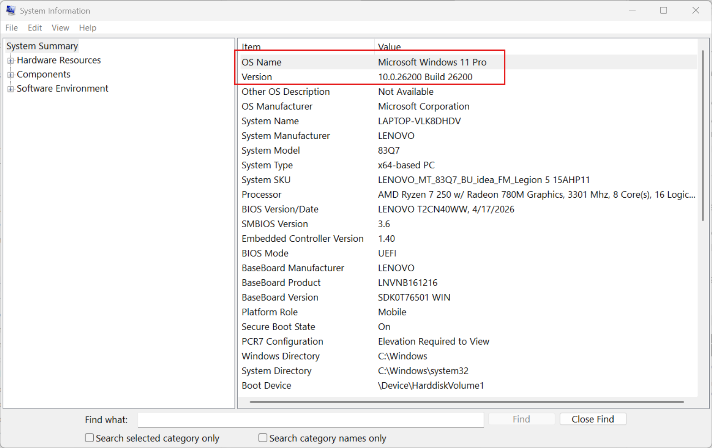
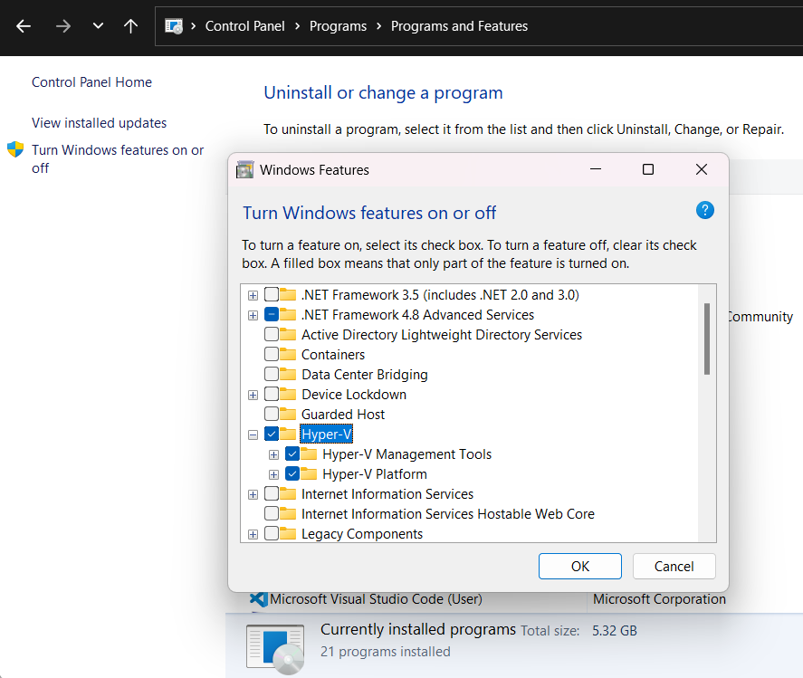

## Step-By-Step: Enable Hyper-V for Use on Windows 11

Hyper-V is virualization technology on Windows 11. Student can run may operating systems and apps on virtual physical machine using Hyper-V virtual machines. Student need to learn to use and enableing Hyper-V on Windows 11. 

Here is step-by-Step guild will show Student to do:

### System requirement
- Windows 11 pro or Enterprise 64 bit operation
- Bios-level hardware virtualzation (VT-x) enables

### Check system competible.
1. press 'Windows key + R to open Run dialog box
1. Type `msinfo32` and press **Enter**



**Open Turn Windows Features on off**
There are many way to enable
1. Run Cmd in Powershell (Run Administrator)

```powershell
Enable-WindowsOptionalFeature -Online -FeatureName Microsoft-Hyper-V -All
```


2. Run DISM Command
```powershell
DISM /Online /Enable-Feature /All /FeatureName:Microsoft-Hyper-V
```


3. Search  "Turn windows features on or off". when Windows features pop up scroll  down until  you find Hyper-V section then check  Both option show below
![[search_turnwindows.png]]



- After enable HyperV.  we need to reboot windows 
- After reboot  run ``CMD`` in powershell to verify below.

```
systeminfo | findstr /i "hypervisor"
## or only
systeminfo
```

![[systemifo.png]]

**Open ``Hyper-V manager`` and create Vitrual Machine**
After Enable Hyper-V on windows 11.  Next step is create virtual machine

1. In the search bar, type Hyper-V manager, then Enter
![[hyperv-manager1.png]]

2. Select the name of Device (you PC) then click new
![[HyperV-new.png]]

3. After Click new , select ``Virual Machine`` to create virtual machine. make sure we have iso file like CenOs 10 stream iso etc.
   ![[hyperv-manager2.png]]

4. When ``New Virtual Machine Wizard`` window open. you will see Menu on left side and configuration on right side. In order to setup Virtual machine, we will move down on left menu one by one. 
![[hyperv-manager3.png]]
5. In Specify Generation select ``Generation1`` , then click ``Next >`` 
![[hyperv-manager4.png]]
6. Assign Memory of Vitrual Machine  ``4096`` MB
![[hyperv-manager5.png]]
7. Configure Network we select  ``Default Network`` this option will assign eth0 ip address to Virual Machine
![[hyperv-manager6.png]]
8. Create Virtual Hard Disk size  ``40 GB`` , Click Next
![[hyperv-manager7.png]]  
9. Install option we will  select  iso file  which already download.  Click ``Next > `` 
![[hyperv-manager8.png]]
10. Install Summary will show every config step we select. this step we can select ``< Previous``  if some config need to change. After check carefully then nothing to needed to be change, then click ``Finish``
![[hyperv-manager10.png]]
11. Next Step We will goto installation process of Cent OS 10 Stream
    
