# Chapter 4: Docker Basics && Dockerfile Workshop (Using CentOS Stream 10)

## Reviews: 
### What is Docker?
Docker is a platform that uses OS-level virtualization to package applications into **containers**. Think of it as lightweight, portable units that include everything needed to run software—code, libraries, dependencies, and configuration.

**Key concepts:**
- **Image**: A read-only template or "blueprint" containing everything needed to run an application
- **Container**: A runnable instance of an image—an isolated environment where the application actually runs

### Docker vs. Virtual Machines
Unlike VMs that require a full operating system per instance, Docker containers share the host OS kernel. This makes containers:
- **Lighter** (megabytes vs. gigabytes for VMs)
- **Faster** to start (seconds vs. minutes)
- **More efficient** with system resources

### Why Use Docker?
- **Environment consistency**: Eliminates "it works on my machine" problems by providing identical environments everywhere
- **Portability**: Run containers on any system with Docker installed—from laptops to cloud servers
- **Isolation**: Containers run independently without interfering with each other

---

## Assignment: Create Student's Submission along tutorial
- Student will submit Screen of Docker installation process according to step-by-step from manual.
- Student can use Basic Template [Download](../assets/dockerbasic-dockerfile-submission.docx)  or generate own version.


### Using CentOS Stream 10 with Docker

If you want to use CentOS Stream 10 as your base image, here's how to find and use it:

#### Pre-built Images on Quay.io

visit [Ref https://quay.io/organization/sclorg ](https://quay.io/organization/sclorg) to review docker image. 

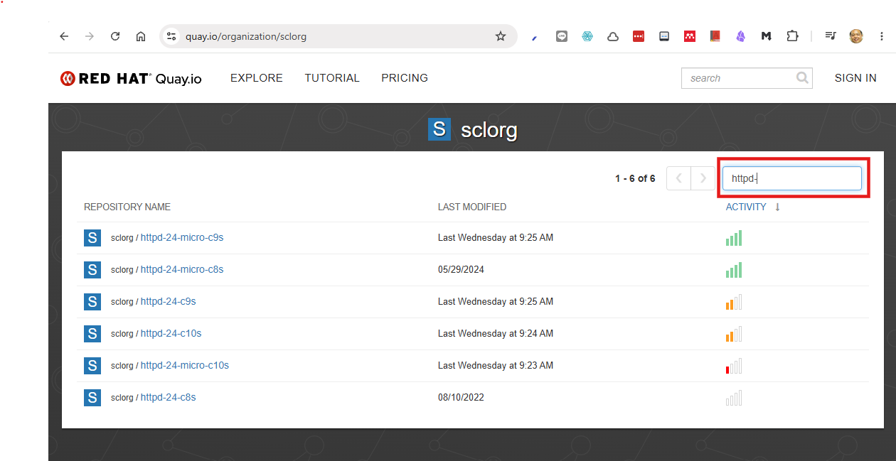

CentOS Stream 10 images are available on **Quay.io** (Red Hat's container registry). Examples include:

| Image Type | Registry Address |
|------------|------------------|
| Apache HTTP Server | `quay.io/sclorg/httpd-24-c10s` |
| PostgreSQL 16 | `quay.io/sclorg/postgresql-16-c10s` |
| Node.js 22 | `quay.io/sclorg/nodejs-22-c10s` |
| Node.js 22 Minimal | `quay.io/sclorg/nodejs-22-minimal-c10s` |
| PostgreSQL 18 | `quay.io/sclorg/postgresql-18-c10s` |
| Mariadb | `quay.io/sclorg/sclorgmariadb-118-c10s` |
 
You can **pull** all of these images in table using:
- use command format ``docker pull <repo name/owner/image name>``
```bash
docker pull quay.io/sclorg/postgresql-16-c10s
docker pull quay.io/sclorg/postgresql-16-c10s
docker pull quay.io/sclorg/nodejs-22-c10s
docker pull quay.io/sclorg/nodejs-22-minimal-c10s
docker pull quay.io/sclorg/postgresql-18-c10s
docker pull quay.io/sclorg/mariadb-118-c10s
```
output:
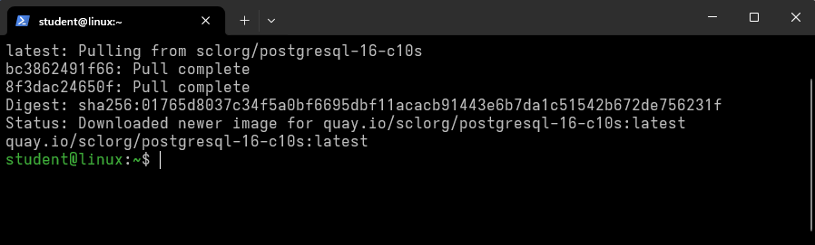

> **Note**: *** pull all image with list in above tables and copy screen in templage.

- run command ``docker image ls`` to verify successfully image from table

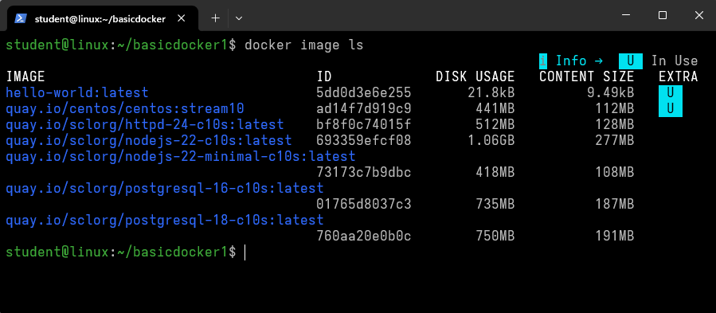

in Development, Container give developer high flexibility and Quick develop applicaion. you can have database without installation. 

## Part 1 Create MaraiDB  (https://mariadb.org/)

Prepare: create project folder
```
mkdir myMariadb
cd myMariadb
```

1.1 create Dockerfile
```
cat >  Dockerfile << 'EOF'
# Use the official SCLorg CentOS Stream 10 MariaDB 11.8 image
FROM quay.io/sclorg/mariadb-118-c10s

# Metadata labels (optional)
LABEL maintainer="your-email@example.com" \
      summary="Custom MariaDB 11.8 with baked-in environment variables"

# Set environment variables for initialization
ENV MYSQL_ROOT_PASSWORD=root_secret \
    MYSQL_DATABASE=app_db \
    MYSQL_USER=app_user \
    MYSQL_PASSWORD=user_secret

# Expose the default MariaDB port
EXPOSE 3306
EOF
```

```
ls -ll
```

output:
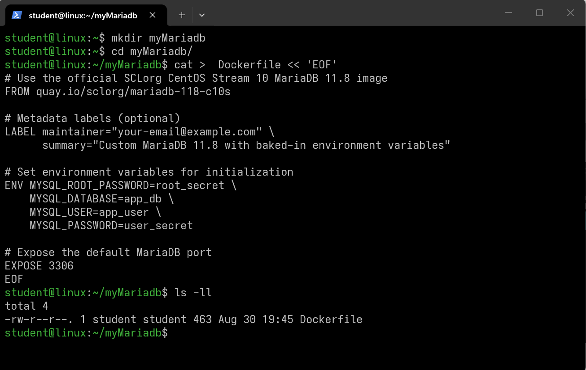

1.2 Build Image
- Build mariadb database from Dockerfile
```
docker build -t my-mariadb-118 .
```

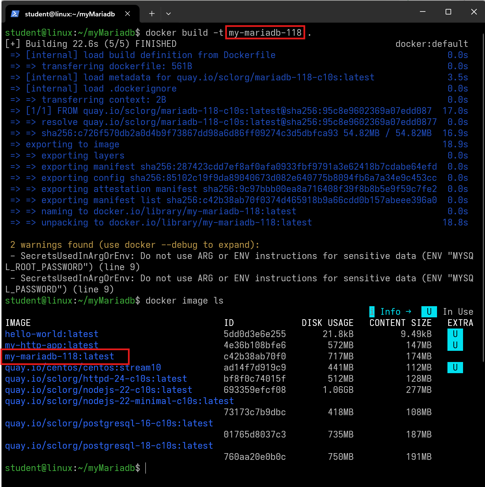


1.3. Open Firewall port 3306

```
# open firewall 3306
sudo firewall-cmd --permanent --add-port=3306/tcp
# reload
sudo firewall-cmd --reload
# firewall list
sudo firewall-cmd --list-all
```

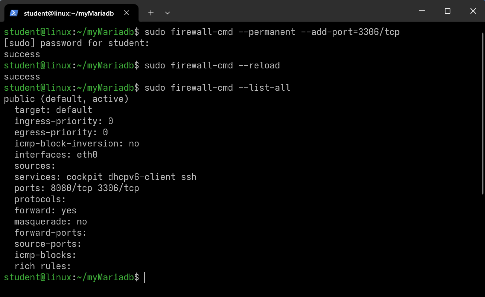

1.4 Create volume
```
docker volume create mariadb_data
docker volume ls
```
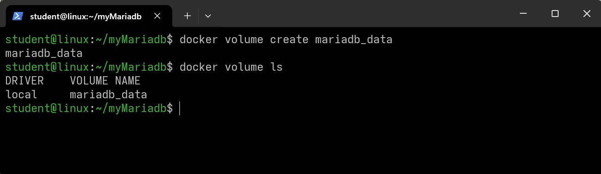

1.5 Run Container
```
docker run -d \
  --name mariadb-118-container \
  -p 3306:3306 \
  -v mariadb_data:/var/lib/mysql:Z \
  my-mariadb-118
```
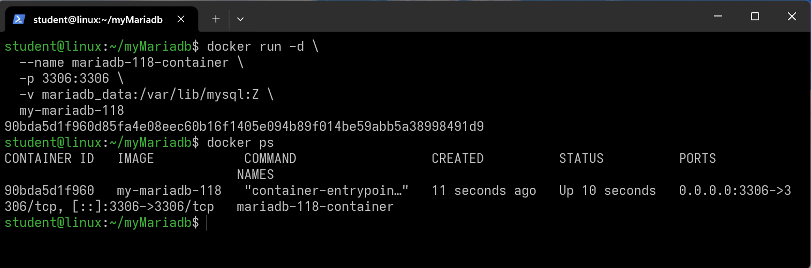

(option: Test Connection data - Dbeaver)

#### Config  with ip address (you may not have same ip address)
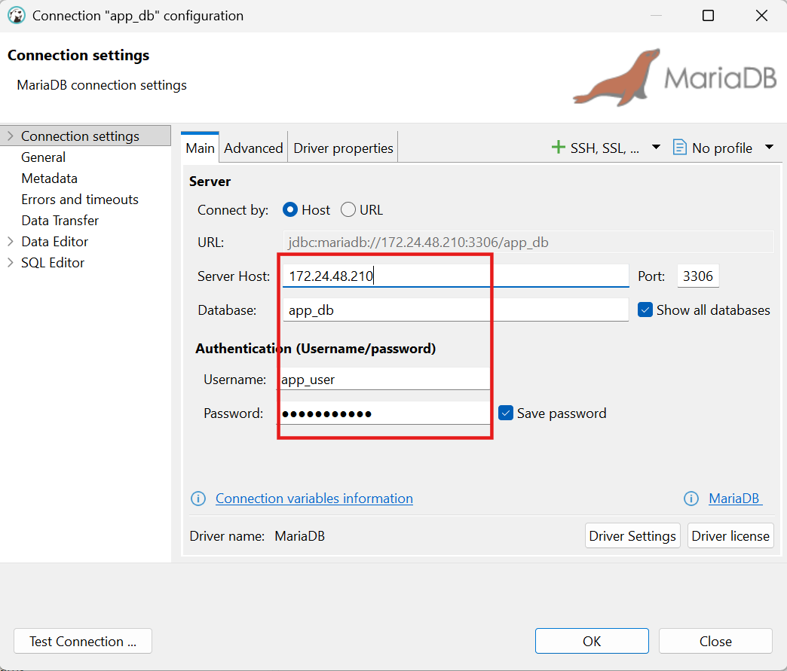

#### Success Connection


Congratuation you've database for your application

1.6 Create databae
```
docker exec -it mariadb-118-container mariadb -u app_user -puser_secret
CREATE DATABASE my_test_db;
```

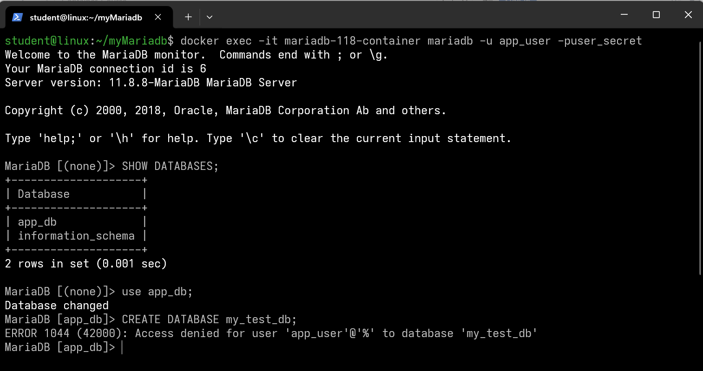


1.7 Give app_user access to the new database

If you want your app_user account to also be able to read and write to this new my_test_db, you need to grant it permissions while you are still logged in as root.

- Run these two commands at the root MariaDB prompt:
- Run without ``-p``  
```
docker exec -it mariadb-118-container mariadb -u root 

GRANT ALL PRIVILEGES ON my_test_db.* TO 'app_user'@'%';
FLUSH PRIVILEGES;
```
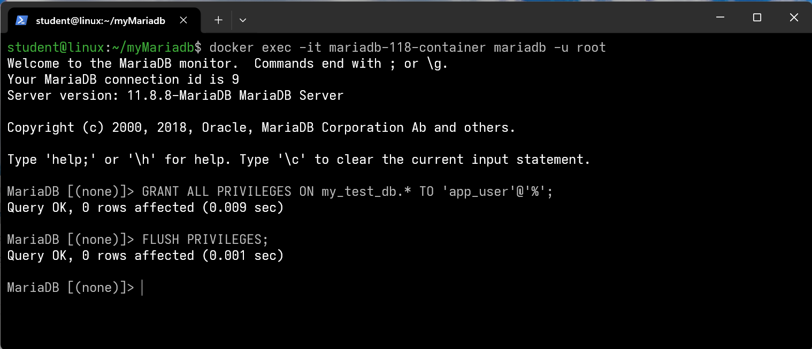

1.8 Re Run 1.6 after add privilage
```
# login database with app_user
docker exec -it mariadb-118-container mariadb -u app_user -puser_secret

# Create database
CREATE DATABASE my_test_db;
```
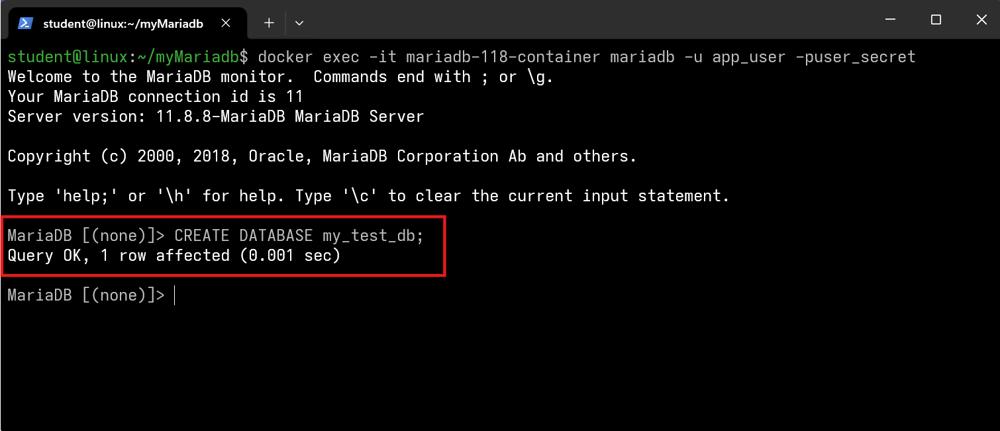


> !!note : By default, some MariaDB configurations allow the root user to connect locally (from inside the container) using a Unix socket without a password, regardless of the password variable you set for remote access.

## Part 2 Next Learn building from a Dockerfile
objective:
- understand role of dockerfile and command to run.
- understand project files structure set up.
- create  basicdocker1 folder as project folder (Remeber there  is only one Dockerfile in each of project)
- project structure:  in this workshop you will create 3 files. Dockerfile, index.html, app.js
    ```
    your-project/
    ├── Dockerfile
    ├── index.html
    └── app.js
    ```
> [Note:] how to check user with run container
> - from sclorg user who run container name 'default'
> - here below how to check user after container has been created.

show how to check:
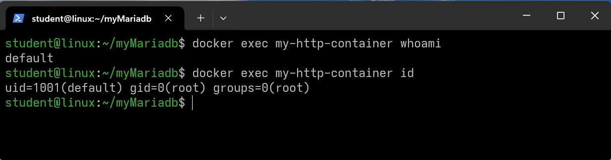

2.1 create folder
```bash
# Create project folder holding your project
mkdir basicdocker1
cd basicdocker1
```
- use structure to generate file (Linux Admin skill call heredoc)
```
cat > Dockerfile << 'EOF'

## content will go here
EOF
```

2.2 generate ``Dockerfile`` to create docker image
```bash
cat > Dockerfile  << 'EOF'
FROM quay.io/sclorg/httpd-24-c10s

# --- Switch to root to install packages ---
USER root

# Install additional packages
RUN dnf install -y curl nginx

# --- Create log directories and set permissions for the 'default' user ---
# Added /var/log/nginx to the list of directories created and chowned
RUN mkdir -p /app/logs /run/nginx /var/lib/nginx/tmp /var/log/nginx && \
    chown -R default:root /app/logs /run/nginx /var/lib/nginx /var/log/nginx

# --- Switch back to the default non-root user ---
USER default

# Set working directory
WORKDIR /app

# --- Copy Nginx configuration ---
COPY nginx.conf /etc/nginx/nginx.conf

# --- Copy application files ---
COPY index.html app.js /app/

# Expose the unprivileged port
EXPOSE 8080

CMD ["nginx", "-g", "daemon off;"]
EOF
```
output:
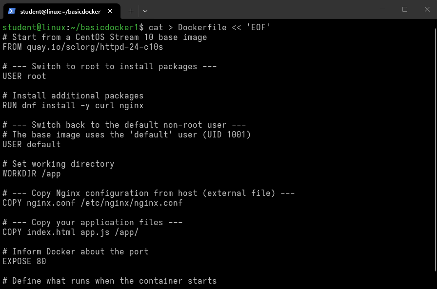

2.3 generate ``index.html``
```bash
cat > index.html << 'EOF'
<!DOCTYPE html>
<html>
<head>
    <title>Web is Running</title>
    <script src="app.js"></script>
</head>
<body>
    <h1>🚀 Web is Running!</h1>
    <p>Nginx is successfully serving files from <code>/app</code>.</p>
    <p>Open your browser console (F12) to see the message from <code>app.js</code>.</p>
</body>
</html>
EOF
```
output:
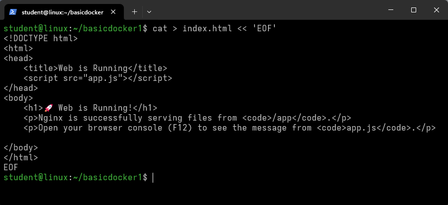

2.4 generate ``app.js`` 
```bash
cat > app.js << 'EOF'
console.log("✅ Web is running! App.js loaded successfully.");
alert("Hello from app.js!");
EOF
```
output:
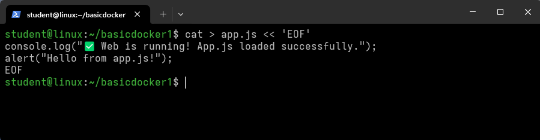

2.5 generate ``nginx.conf``
```bash
cat > nginx.conf << 'EOF'
# --- Tell Nginx to write the PID file in the writable directory ---
pid /run/nginx/nginx.pid;
error_log /app/logs/error.log;

events {
    worker_connections 1024;
}

http {
    include /etc/nginx/mime.types;
    default_type application/octet-stream;
    access_log /app/logs/access.log;
    
    server {
        # Listen on an unprivileged port since we are running as a non-root user
        listen 8080;
        server_name localhost;

        root /app;
        index index.html;

        location / {
            try_files $uri $uri/ =404;
        }
    }
}
EOF
```
output:  
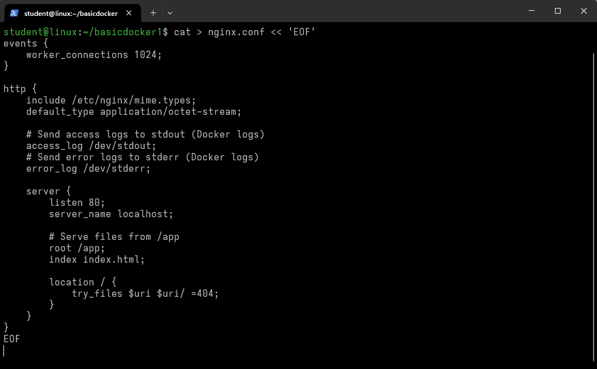

2.6 List output files in project folder 

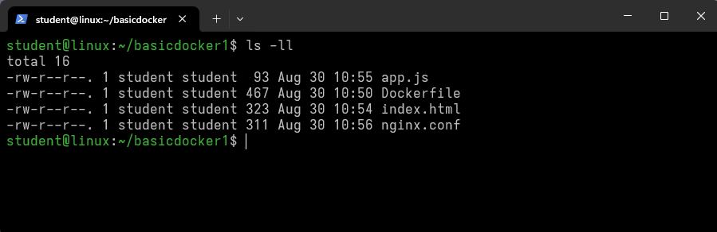


2.7 Explaination
```dockerfile
cat > Dockerfile  << 'EOF'
FROM quay.io/sclorg/httpd-24-c10s

# --- Switch to root to install packages ---
USER root

# Install additional packages
RUN dnf install -y curl nginx

# --- Create log directories and set permissions for the 'default' user ---
# Added /var/log/nginx to the list of directories created and chowned
RUN mkdir -p /app/logs /run/nginx /var/lib/nginx/tmp /var/log/nginx && \
    chown -R default:root /app/logs /run/nginx /var/lib/nginx /var/log/nginx

# --- Switch back to the default non-root user ---
USER default

# Set working directory
WORKDIR /app

# --- Copy Nginx configuration ---
COPY nginx.conf /etc/nginx/nginx.conf

# --- Copy application files ---
COPY index.html app.js /app/

# Expose the unprivileged port
EXPOSE 8080

CMD ["nginx", "-g", "daemon off;"]
EOF

```
2.8 Enable firewall 
```bash
sudo firewall-cmd --zone=public --add-port=8080/tcp --permanent
sudo firewall-cmd --reload
```


2.9 Build and Run
- docker will run command line by line
- each time when it run will create readonly layer
```bash
# Build the image (do not 'dot' end of command)
docker build -t my-http-app .
```
output: 
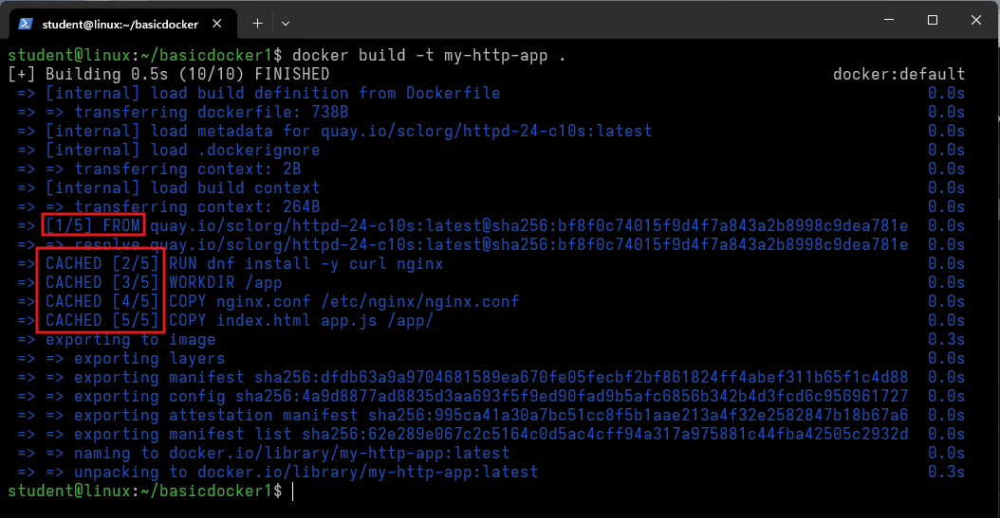

2.10 list your image
- verify list ouf output image from command
```
docker image  ls
```
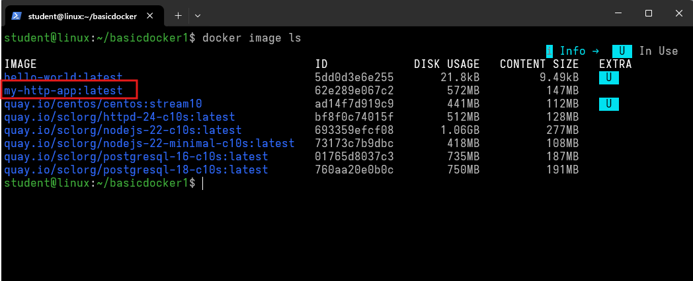

- Special note: 
how we can check each layer
```
docker image history my-http-app
```
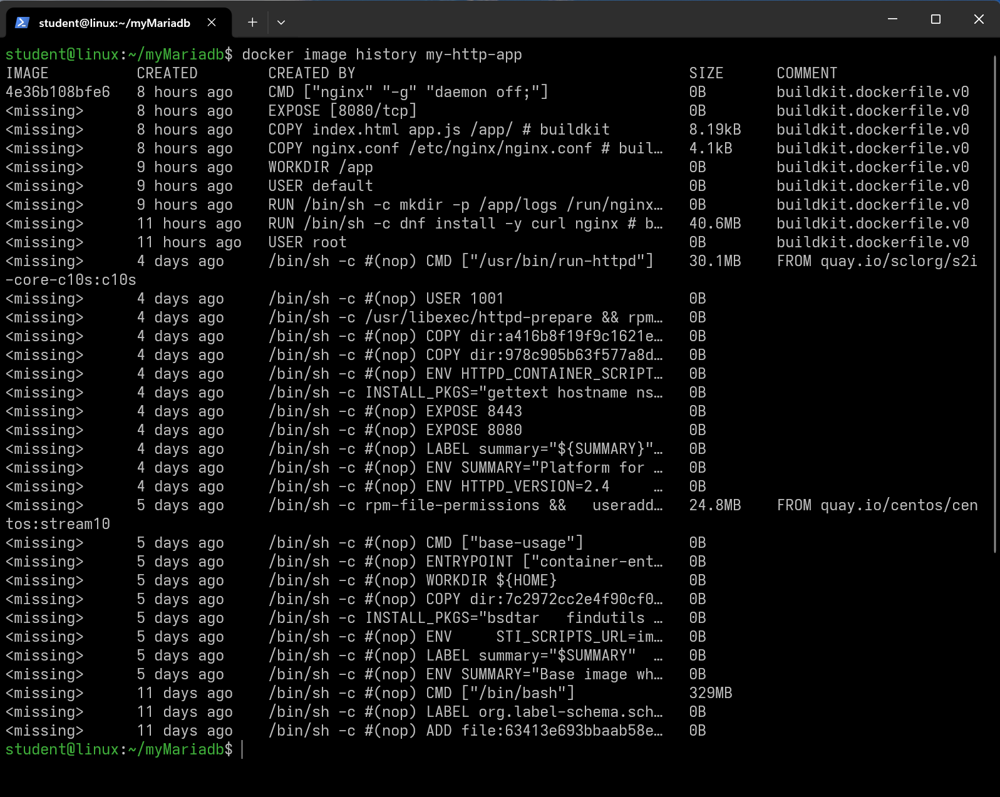

2.11 Create host_logs folder to store log outsite container
```

mkdir -p ./host_logs
sudo chmod 777 ./host_logs
docker run  -p 8080:80 --name my-http-container  -v "$(pwd)/host_logs:/app/logs" my-http-app

# after run terminal will hold session - not return terminal to user
```
- open browser and view index.html

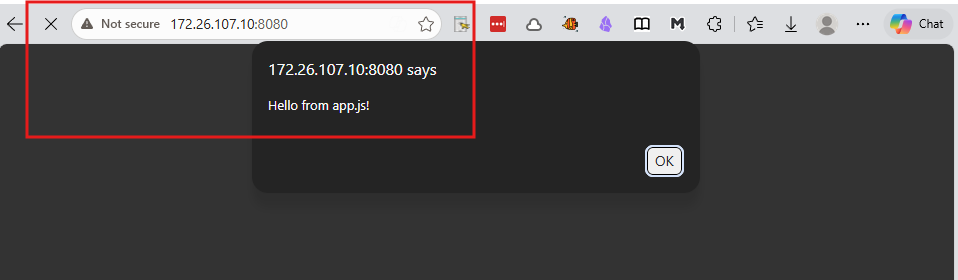

2.12 Open open new terminal
```bash
# Run a container from the image
docker exec -it my-http-container /bin/bash
```

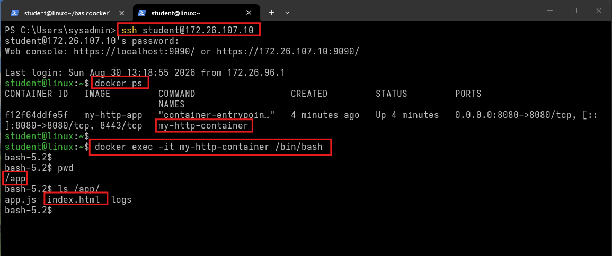


> Quiz:  Create Postgresql Database from ``quay.io/sclorg/> > postgresql-18-c10s``  
> - create project folder myPostgresql  
> - Create Dockerfile inside folder  
> - Show command which create docker image with name 'my-postgresql-db'
> - Show command which create container name 'my-postgresql-container'
> - enable Firewall rule for postgresql
> - show screen of command, or any application with prove connecting successfully to container

---

# Reading Note on Docker Technology
## Try to understand most core basic of Docker Technology
When the **Docker daemon (service)** processes a `Dockerfile` during `docker build`, it reads the instructions **top-down**, executing each statement sequentially. Each instruction (except `CMD`) creates a new **read-only layer** in the image filesystem, which is cached for future builds.

Here is a comprehensive summary in **table format**, covering when, how, and what each of your specified commands does:

| Instruction | Execution Phase | Primary Purpose | Creates a Layer? | Key Behavior & Details |
| :--- | :--- | :--- | :--- | :--- |
| **`FROM`** | **Build Time** | Sets the base image for subsequent instructions. | **Yes** (pulls parent layers) | The service checks the local cache; if missing, it pulls the image from the registry. Every valid Dockerfile must start with this. |
| **`RUN`** | **Build Time** | Executes commands (e.g., `dnf install`) in a new shell. | **Yes** | The daemon runs the command, commits the result to a new layer, and saves it. This is where you install system packages and modify files inside the image. |
| **`WORKDIR`** | **Build Time**<br>*(affects Runtime)* | Sets the current working directory for **subsequent** `RUN`, `CMD`, `COPY`, and `ENTRYPOINT` instructions. | **No** (metadata only) | If the directory does not exist inside the temporary container, the daemon automatically creates it. It changes the filesystem path context for the next commands. |
| **`COPY`** | **Build Time** | Copies new files/directories from the **build context** (your host machine) into the container's filesystem. | **Yes** | The daemon reads the source files from the host, streams them into the build container, and commits the new filesystem state as a layer. *Note: It does NOT support URL fetching (use `ADD` for that).* |
| **`CMD`** | **Runtime**<br>(Container Start) | Provides default arguments/command for the running container. | **No** (config metadata) | The daemon **does not execute** this during `docker build`. Instead, it stores this command as metadata in the image config. When you run `docker run` (or the service starts a container), the daemon executes this. **Important:** If the container runs with a different command (e.g., `docker run <image> /bin/bash`), this `CMD` is entirely **overridden**. |

---

###  Additional Context from the Daemon's Perspective

1.  **Layer Caching**: The daemon uses a cache to speed up builds. If it finds an unchanged instruction (e.g., `COPY . .` with unchanged files) and a cached layer exists, it will reuse it instead of rebuilding.
2.  **Build Context**: Before processing `COPY`, the daemon receives a compressed "build context" (the directory where you run `docker build`). `COPY` can only access files within this context for security reasons.
3.  **Shell Form vs. Exec Form**: 
    - `RUN dnf install -y curl` uses **shell form** (runs `/bin/sh -c`).
    - `CMD ["nginx", "-g", "daemon off;"]` uses **exec form** (runs directly without a shell). The daemon prefers exec form because it handles signals (like `SIGTERM`) properly, allowing for graceful shutdowns.
4.  **Docker Service (Swarm/Compose)**: If you deploy this image via **Docker Service** (`docker service create`), the service manager ignores the `CMD` if you specify a command in the service definition, exactly like `docker run`.


### Basic Docker Commands Cheat Sheet

| Command | Purpose |
|---------|---------|
| `docker pull IMAGE` | Download an image from a registry |
| `docker build -t NAME .` | Build an image from a Dockerfile |
| `docker run IMAGE` | Create and start a container from an image |
| `docker run -it IMAGE /bin/bash` | Run interactively with a shell |
| `docker ps` | List running containers |
| `docker ps -a` | List all containers (including stopped) |
| `docker stop CONTAINER_ID` | Stop a running container |
| `docker rm CONTAINER_ID` | Remove a stopped container |
| `docker image ls` | List downloaded images |

### Important Notes
- Docker commands typically require `sudo` permission
- You can add your user to the `docker` group to avoid using `sudo`
- CentOS Stream 10 images are available primarily through **Quay.io**, not Docker Hub


