# Chapter 5: Docker Compose

## Overview

This chapter covers Docker Compose for defining and running multi-container applications.
### Objective
- Can explain what objects that docker compose can create.
- Can explain structure of docker-compose.yaml files
- Can write and fix error in docker-compose.yaml
- Can deploy application with docker-compose.yaml


## Assignment: Create Student's Submission along tutorial
- Student will submit Screen of Docker installation process according to step-by-step from manual.
- Student can use Basic Template [Download](../assets/dockerbasic-dockercompose-submission.docx)  or generate own version.

## Introduction 
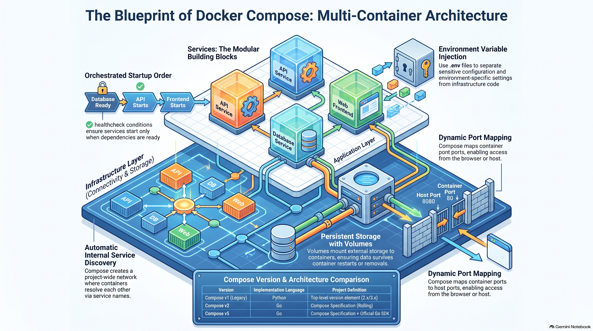


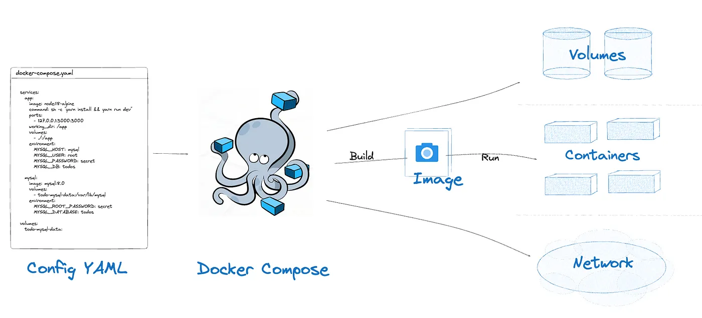
---
## Basic Yaml file
> YAML is a human-readable data serialization language that is often used for writing configuration files. Depending on whom you ask, YAML stands for yet another markup language or YAML ain’t markup language (a recursive acronym), which emphasizes that YAML is for data, not documents. 

> YAML files use a .yml or .yaml extension, and follow specific syntax rules.  “What do the 3 dashes mean?” 3 dashes (---) are used to signal the start of a document, while each document ends with three dots

```
#Comment: This is a supermarket list using YAML
#Note that - character represents the list
---
food: 
  - vegetables: tomatoes #first list item
  - fruits: #second list item
      citrics: oranges 
      tropical: bananas
      nuts: peanuts
      sweets: raisins
```

## Map vs List in Yaml

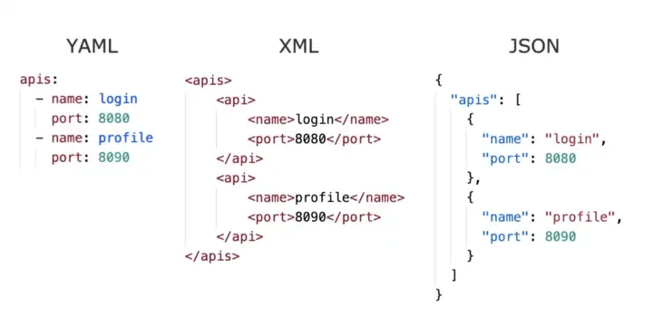

[### Reading understand map and list in yaml](00-yaml.md)

Example Student record can represent in yaml format

```yaml
#Comment: Student record
#Describes some characteristics and preferences
---
name: Martin D'vloper #key-value
age: 26
hobbies: 
  - painting #first list item
  - playing_music #second list item
  - cooking #third list item
programming_languages:
  java: Intermediate
  python: Advanced
  javascript: Beginner
favorite_food: 
  - vegetables: tomatoes 
  - fruits: 
      citrics: oranges 
      tropical: bananas
      nuts: peanuts
      sweets: raisins
```

## Workshop 5.1 Wordpress Blog

```bash
cd ~
mkdir wordpress
cd wordpress
```

```bash
cat > docker-compose.yaml << 'EOF'

services:
  wordpress_db:
    image: quay.io/sclorg/mariadb-118-c10s
    restart: always
    environment:
      MYSQL_ROOT_PASSWORD: wordpress
      MYSQL_DATABASE: wordpress
      MYSQL_USER: wordpress
      MYSQL_PASSWORD: wordpress
    networks:
      - wordpress_net
    volumes:
      - wordpress_data:/var/lib/mysql

  wordpress:
    depends_on:
      - wordpress_db
    image: wordpress:latest
    restart: always
    ports:
      - "80:80"
    environment:
      WORDPRESS_DB_HOST: wordpress_db:3306
      WORDPRESS_DB_USER: wordpress
      WORDPRESS_DB_PASSWORD: wordpress
      WORDPRESS_DB_NAME: wordpress
    networks:
      - wordpress_net
    volumes:
      - wordpress_web:/var/www/html

volumes:
  wordpress_data: {}
  wordpress_web: {}

networks:
  wordpress_net: {}

EOF

```
Run Command

```bash
# check firewall
sudo firewall-cmd --permanent --add-port=80/tcp
sudo firewall-cmd --reload
sudo firewall-cmd --list-all
```

```bash
# start service
docker compose up -d 
docker compose ps

# stop container
# remove only container , keep volume
docker compose down 
-or-
# stop will remove container and volume
docker compose down -v
```
File docker compose structure

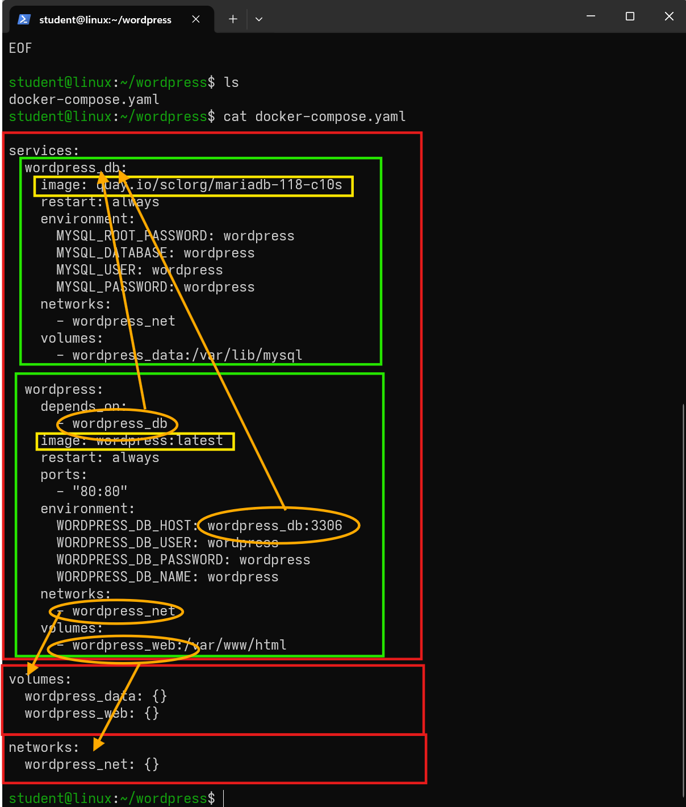

## Tasks: 
- Capture screen output of command 
  - `docker compose up -d`
  - `docker compose ps`

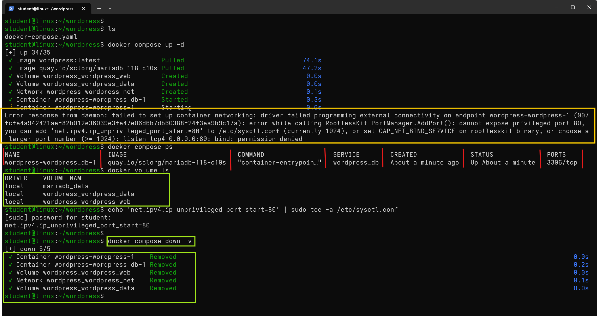

> Error response from daemon: failed to set up container networking: driver failed programming external connectivity on endpoint wordpress-wordpress-1 (907fcfe4a942421aef82b012e36039e3fe47e06d6b7db60388f24f3ea9b9c17a): error while calling RootlessKit PortManager.AddPort(): cannot expose privileged port 80, you can add 'net.ipv4.ip_unprivileged_port_start=80' to /etc/sysctl.conf (currently 1024), or set CAP_NET_BIND_SERVICE on rootlesskit binary, or choose a larger port number (>= 1024): listen tcp4 0.0.0.0:80: bind: permission denied

## Fix permission
```bash
# modify /etc/sysctl.conf
echo 'net.ipv4.ip_unprivileged_port_start=80' | sudo tee -a /etc/sysctl.conf

# reload
sudo sysctl -p
-or-
sudo sysctl --system

# verify 
sysctl net.ipv4.ip_unprivileged_port_start
```
- after fix variable then start again.
```bash
docker compose down -v
docker compose up
```

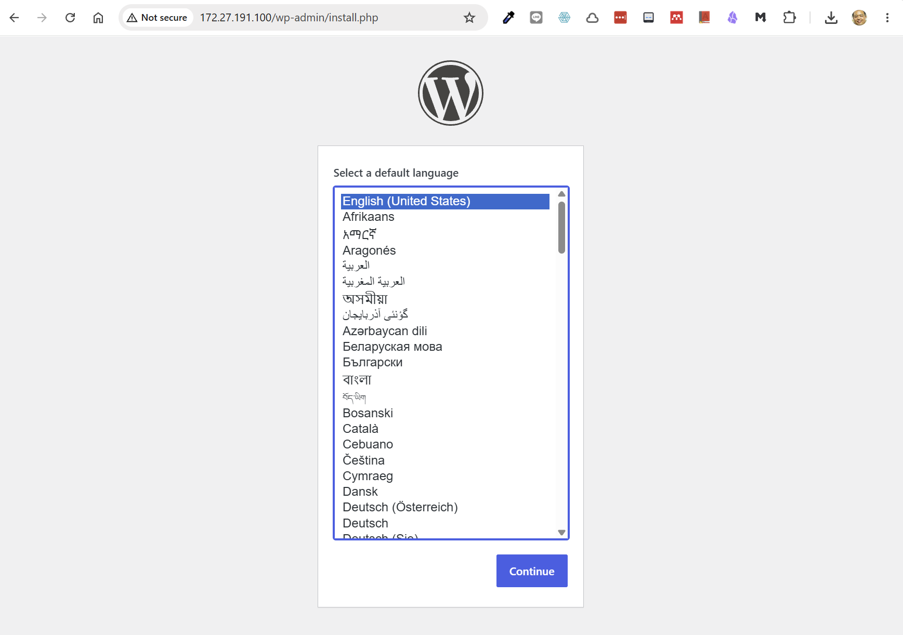

## Workshop 5.2 Flash Web
### Step 1 Setup project
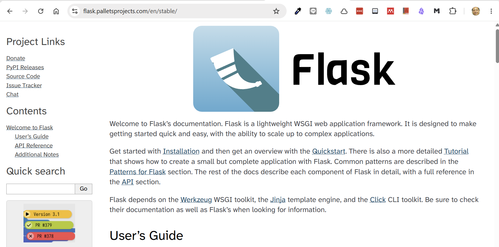

1. Create a directory for project
```
$ cd ~
$ mkdir flask-demo
$ cd flask-demo
```

2. create `app.py` in you project directory

```bash
cat > app.py << 'EOF'
import os
import redis
from flask import Flask

app = Flask(__name__)
cache = redis.Redis(
    host=os.getenv("REDIS_HOST", "redis"),
    port=int(os.getenv("REDIS_PORT", "6379")),
)

@app.route("/")
def hello():
    count = cache.incr("hits")
    return f"Hello from Docker! I have been seen {count} time(s).\n"

EOF

```
The app reads its Redis connection details from environment variable  `hits` 

3. Create `requirements.txt`
```
cat > requirements.txt << 'EOF'
flask
radis
EOF

```

4. Create Dockerfile 
```bash
cat > Dockerfile << 'EOF'
FROM python:3.12-slim

WORKDIR /code

ENV FLASK_APP=app.py
ENV FLASK_RUN_HOST=0.0.0.0

# Copy requirements first to leverage Docker cache
COPY requirements.txt .

# Install dependencies (wheels will just work!)
RUN pip install --no-cache-dir -r requirements.txt

COPY . .

EXPOSE 5000
CMD ["flask", "run", "--debug"]

EOF

```

5. Create `.env`
```bash
cat >  .env  << 'EOF'
APP_PORT=8000
REDIS_HOST=redis
REDIS_PORT=6379

EOF

```

6. Create `.gitignore`
```bash
cat > .gitignore << 'EOF'
.env
*.pyc
__pycache__
redis-data
EOF

```
-  list files in folder with `ls -la`
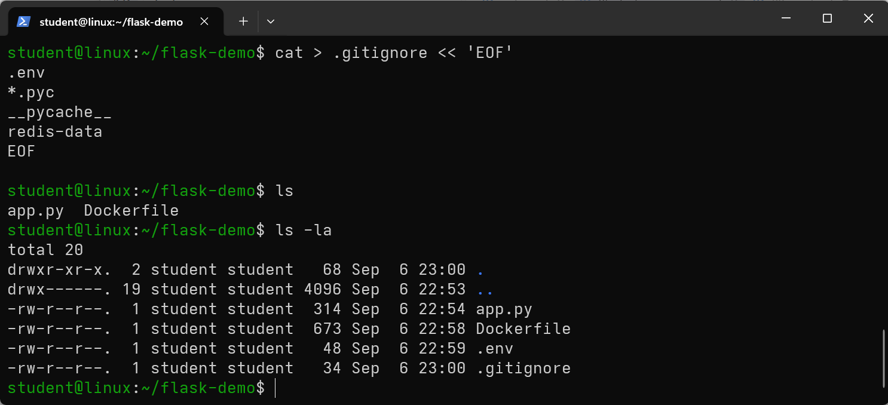

### Step 2
1.  create docker-compose.yaml  (or just compose.yml)

```bash
cat > docker-compose.yaml << 'EOF'
services:
  web:
    build: .
    ports:
      - "${APP_PORT}:5000"
    environment:
      - REDIS_HOST=${REDIS_HOST}
      - REDIS_PORT=${REDIS_PORT}

  redis:
    image: redis:alpine

EOF

```

2. open firewall port 5000/tcp
```bash
sudo firewall-cmd --permanent --add-port=8000/tcp
sudo firewall-cmd --reload
sudo firewall-cmd --list-all
```

3. run start application
```bash
# run with `--build` option
$ docker compose up -d --build
$ docker compose ps -a
```

## Tasks
- Capture screen command `docker compose up -d` and `docker compose ps`

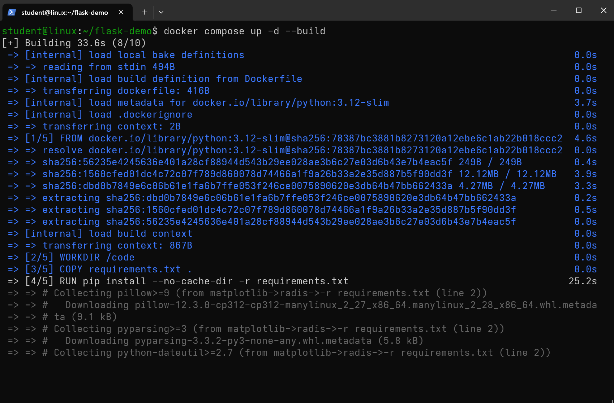

- Capture web   `http://<your-ip>:5000`

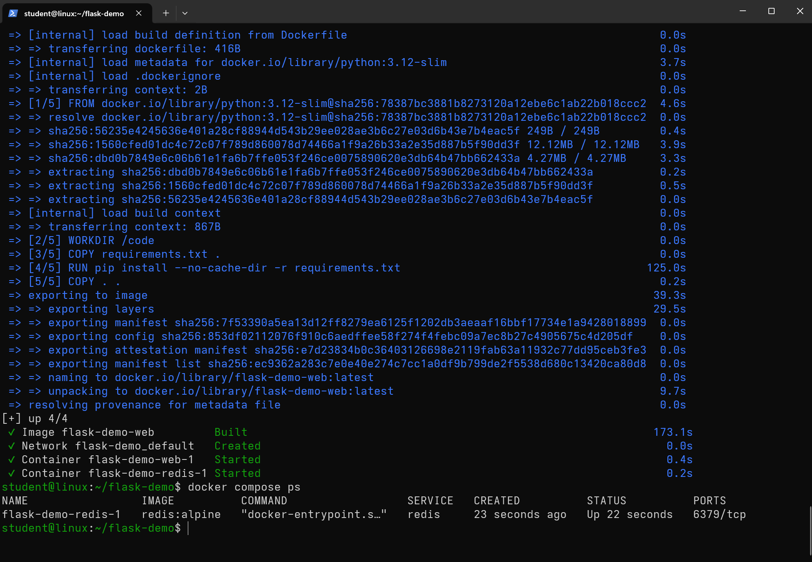

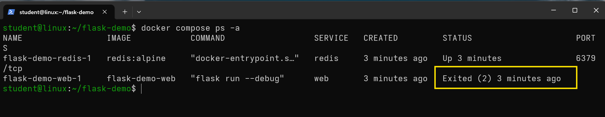

# monitor log with command `docker logs`
```
docker logs flask-demo-web-1
```

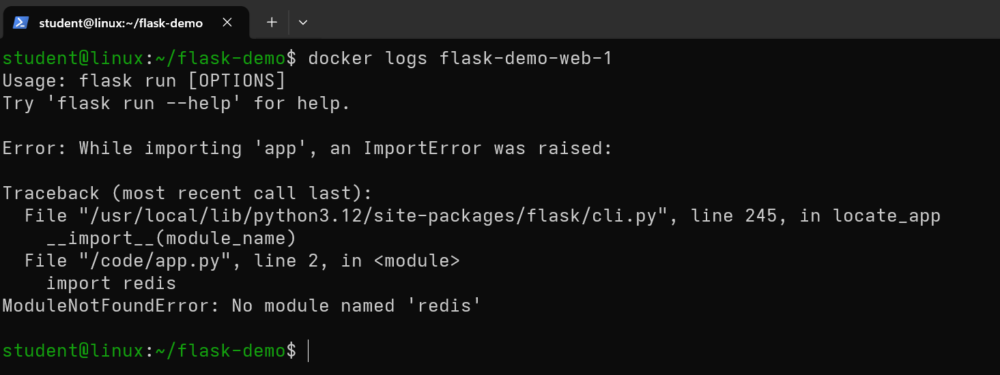

## Task Fix app.py and run again

> ### hint 
> Why This Happens
Your requirements.txt does not include the redis package.
The pip install -r requirements.txt step installed only the packages listed in that file. Since redis wasn't there, it wasn't installed. The Flask app expects it, so it crashes at runtime.

- After fix then copy web screen

## Workshop 5.3 Data science jupyter lab

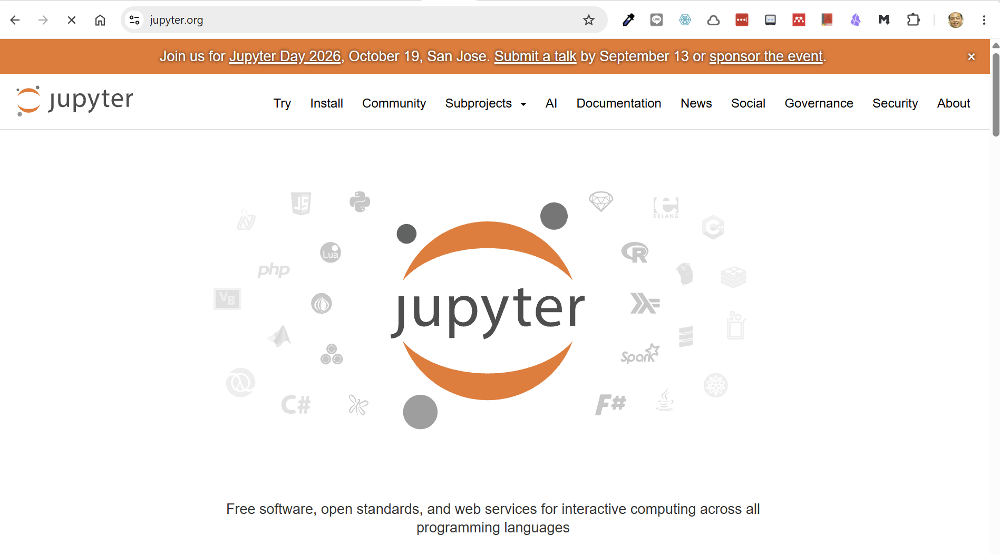

1. setup project
```bash
cd ~
mkdir jupyter
cd jupyter
mkdir notebooks
```

2 Create `docker-compose.yaml`
```bash
cat >  docker-compose.yaml  <<  'EOF'

services:
  jupyter:
    image: jupyter/datascience-notebook:latest              #  Official data science image
    container_name: jupyter-lab
    restart: unless-stopped                                 #  Autorestart policy
    ports:
      - "8888:8888"                                         #  Port mapping
    volumes:
      - ./notebooks:/home/jovyan/work                       #  Persistent storage
    environment:
      - JUPYTER_TOKEN=password123                            #  Access token (change this!)
      - JUPYTER_ENABLE_LAB=yes                              #  Enable Lab interface
      - TZ=Asia/Bangkok                                     #  Time zone (adjust as needed)
EOF

```

3 Open firewall
```
sudo firewall-cmd --permanent --add-port=8888/tcp
sudo firewall-cmd --reload
sudo firewall-cmd --list-all
```

4 Start application
```
$ docker compose up -d
```

## Task
- docker compose ps
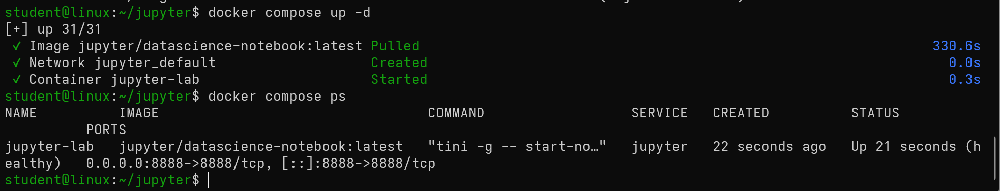
- Copy screen jupyter lab
- password is password123

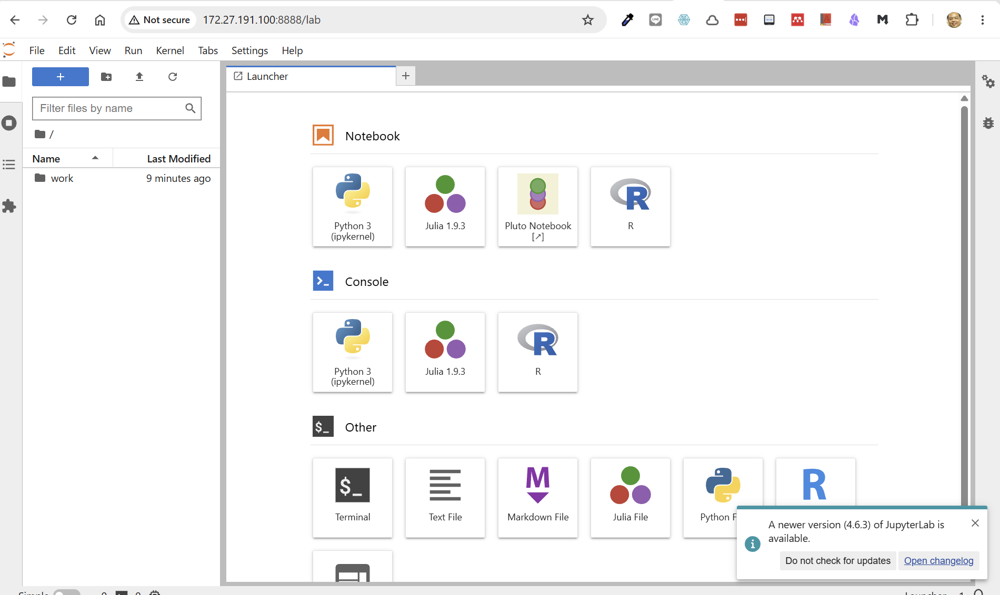