# Chapter 6: Docker Advanced

## Overview
### Objectives
- Understand multi-stage builds and image optimization
- Learn Docker BuildKit features
- Understand Docker overlay filesystem
- Master container resource management
- Configure Docker networking
- Set up and use Docker private registries

---

## Assignment: Create Student's Submission along tutorial
- Student will submit Screen of Docker installation process according to step-by-step from manual.
- Student can use Basic Template [Download checklist submission](../assets/Student%20Self-Verification%20Checklist.docx) or generate own version.
- check checklist file [Check list help](./06_checklist.md) 

## Ref Reading
- [docker officail reference](https://docs.docker.com/build/building/multi-stage/)
---


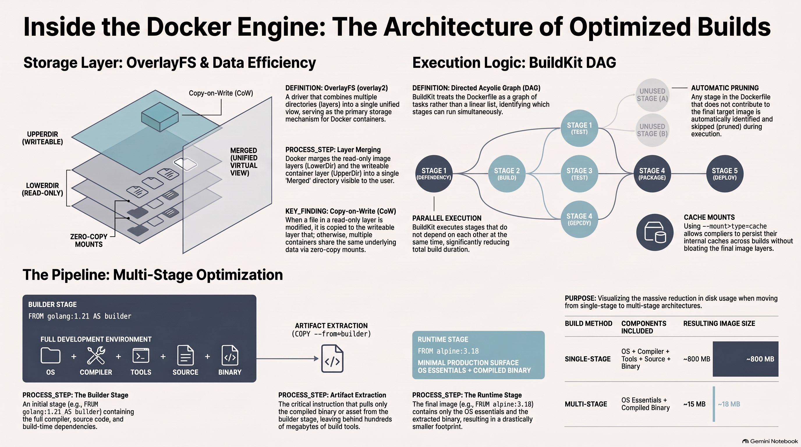

### 1. Key Advantages of the Overlay Filesystem (OverlayFS / overlay2)
The Overlay Filesystem is a modern union filesystem that combines multiple underlying directories into a single, unified filesystem view. It plays a crucial role in making Docker builds fast, storage-efficient, and lightweight:
- **Union Directory Layering (lowerdir, upperdir, merged):**
    - **lowerdir:**  Read-only base layers (such as OS images or pre-installed SDKs)

    - **upperdir:** The read-write layer where new file changes from a build step are written

    - **merged:** The unified mount point where Docker presents the combined filesystem 

- **Copy-on-Write (CoW) Efficiency:** If a build instruction (RUN, COPY) modifies an existing file, OverlayFS copies the file from lowerdir to upperdir before editing. Unchanged files are never duplicated, drastically saving disk I/O and storage space

- **Instant Layer Mounts:** Rather than extracting heavy tarballs or copying full directory trees for each Dockerfile line, Docker simply mounts existing layer directories on host storage (/var/lib/docker/overlay2/)


# Workshop 1: Image Optimization

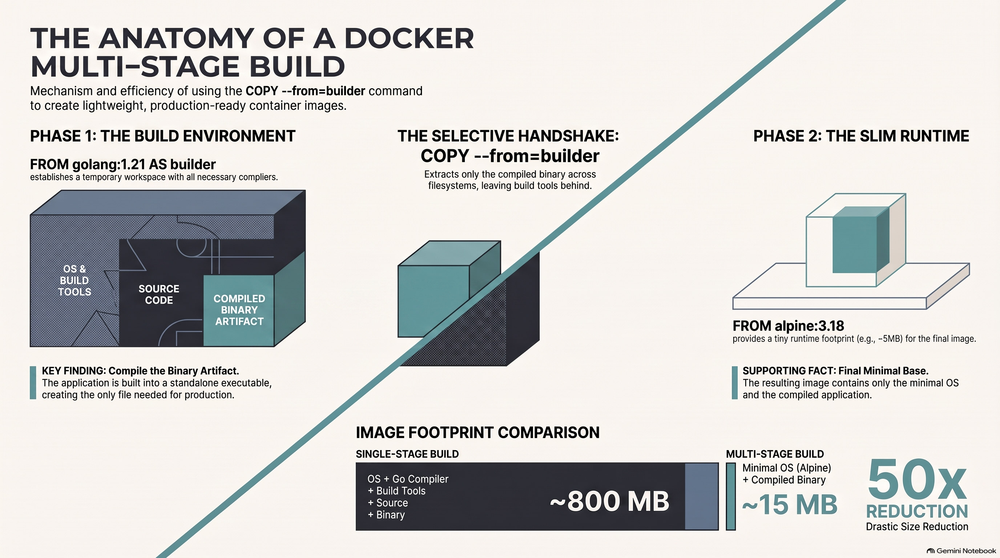


# Lab 1.1: Multi-stage Build - Go Application

## Step 1: Create project directory
```bash
mkdir ~/go-multistage
cd ~/go-multistage
```

## Step 2: Create main.go application
```bash
cat > main.go << 'EOF'
package main

import (
    "fmt"
    "net/http"
    "os"
    "runtime"
)

func main() {
    http.HandleFunc("/", func(w http.ResponseWriter, r *http.Request) {
        hostname, _ := os.Hostname()
        fmt.Fprintf(w, "Hello from Go container!\n")
        fmt.Fprintf(w, "Hostname: %s\n", hostname)
        fmt.Fprintf(w, "Go Version: %s\n", runtime.Version())
        fmt.Fprintf(w, "OS/Arch: %s/%s\n", runtime.GOOS, runtime.GOARCH)
    })

    http.HandleFunc("/health", func(w http.ResponseWriter, r *http.Request) {
        w.WriteHeader(http.StatusOK)
        fmt.Fprintf(w, "OK")
    })

    fmt.Println("Server starting on :8080")
    http.ListenAndServe(":8080", nil)
}
EOF

```

## Step 3: Create single-stage Dockerfile (show problem)
```bash
cat > Dockerfile.single << 'EOF'
FROM golang:1.21

WORKDIR /app

COPY main.go .

RUN go build -o server main.go

EXPOSE 8080

CMD ["./server"]
EOF

```

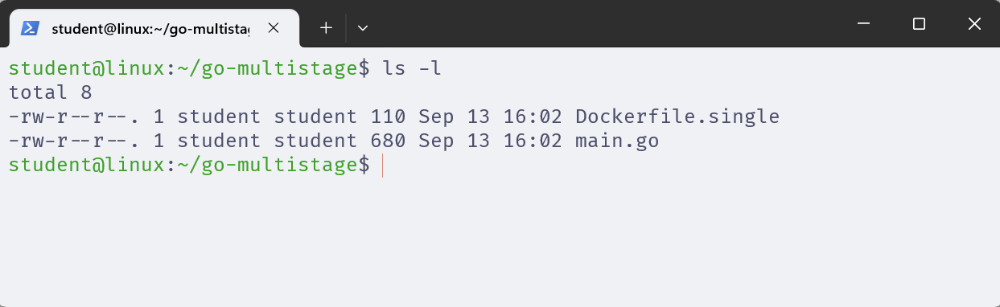

## Step 4: Build and check image size
```bash
docker build -t go-single -f Dockerfile.single .
docker images go-single
```

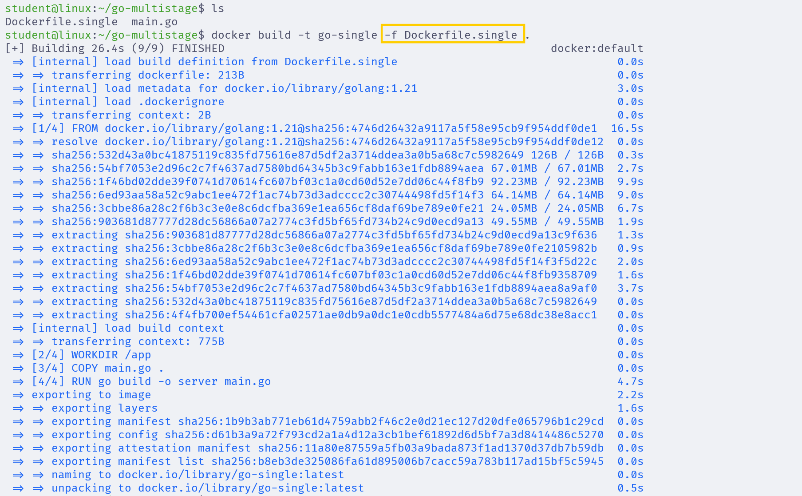

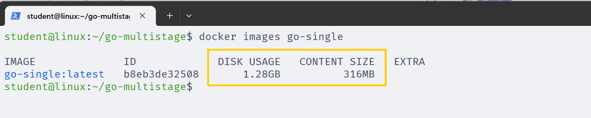
## Image Sizes

| Metric | Size | What it means |
|--------|------|---------------|
| **DISK USAGE** | **1.28 GB** | Total space the image occupies on disk (uncompressed layers + metadata) |
| **CONTENT SIZE** | **316 MB** | Actual size of the image content (compressed/sum of layer content) |

## Key Difference

- **DISK USAGE (1.28 GB)** — The real amount of disk space consumed locally. This includes all layers unpacked on your filesystem.
- **CONTENT SIZE (316 MB)** — The size of the image as it would be pushed/pulled from a registry (compressed layers). This is what you'd see on Docker Hub.

> **Note:** Single-stage image is 1.2GB because it includes Go compiler and all build tools

## Step 5: Create multi-stage Dockerfile
```bash
cat > Dockerfile << 'EOF'
# Build stage
FROM golang:1.21 AS builder

WORKDIR /app

COPY main.go .

RUN CGO_ENABLED=0 GOOS=linux go build -o server main.go

# Final stage
FROM alpine:3.18

RUN apk --no-cache add ca-certificates

WORKDIR /root/

COPY --from=builder /app/server .

EXPOSE 8080

CMD ["./server"]
EOF

```

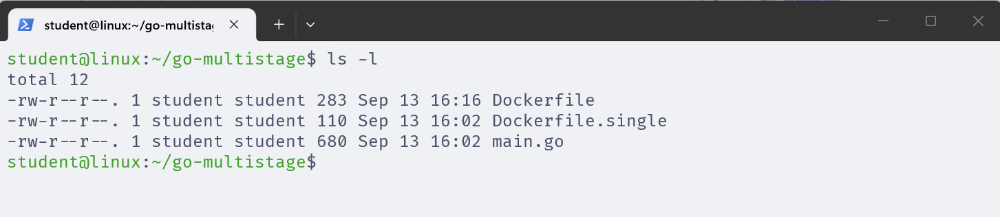

## Step 6: Build and compare image sizes
```bash
docker build -t go-multi .
docker images | grep go-
```

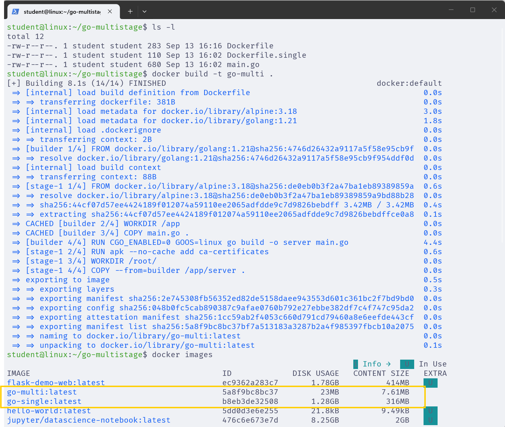

> **Note:** Multi-stage image is 23MB - over 5x smaller!

## Step 7: Verify application works
```bash
docker run -d --name go-app -p 8080:8080 go-multi
curl http://localhost:8080
docker stop go-app
docker rm go-app
```

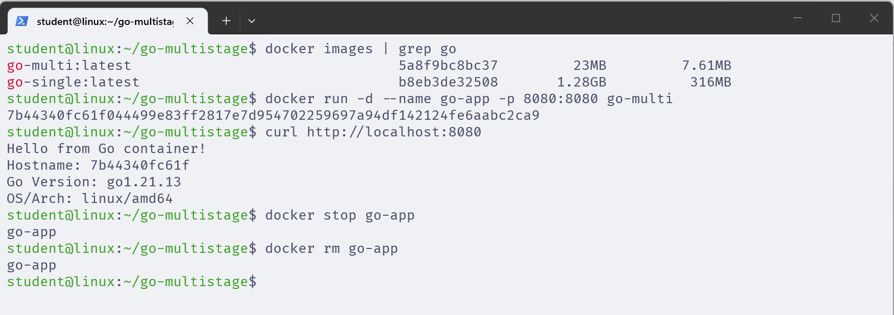
---


# Lab 1.2: BuildKit Features

## Step 1: Enable BuildKit
```bash
export DOCKER_BUILDKIT=1
docker build --version
```

## Step 2: Create Dockerfile with cache mounts
```bash
cat > Dockerfile.buildkit << 'EOF'
FROM golang:1.21 AS builder

WORKDIR /app

# Use cache mount for Go module cache
COPY main.go .

RUN --mount=type=cache,target=/go/pkg/mod \
    --mount=type=cache,target=/root/.cache/go-build \
    CGO_ENABLED=0 GOOS=linux go build -o server main.go

FROM alpine:3.18

COPY --from=builder /app/server /server

EXPOSE 8080

CMD ["/server"]
EOF

```

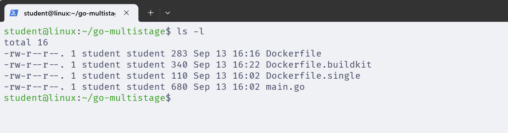

## Step 3: Build with BuildKit caching
```bash
DOCKER_BUILDKIT=1 docker build -t go-buildkit -f Dockerfile.buildkit .

```

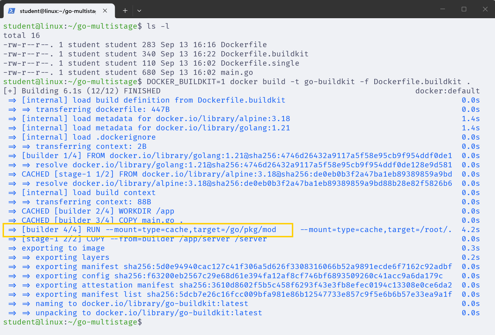
```bash
time docker build -t go-buildkit-cache -f Dockerfile.buildkit .
```

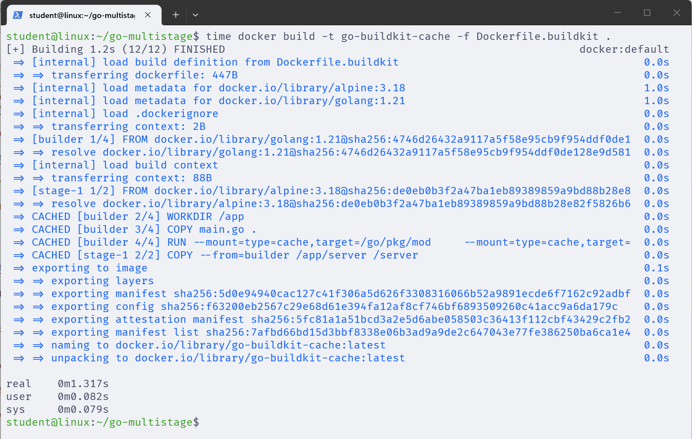

> **Note:** Second build is faster due to BuildKit cache mounts

## Step 4: Use build secrets with --mount=type=secret
```bash
echo "my-api-key-12345" > api-key.txt
```

```
cat > Dockerfile.secret << 'EOF'
FROM alpine:3.18

# Copy secret during build (not in final image)
RUN --mount=type=secret,id=apikey \
    cat /run/secrets/apikey > /tmp/key.txt

# Verify secret is not in final layer
RUN rm /tmp/key.txt

CMD ["echo", "Secret build completed"]
EOF

```

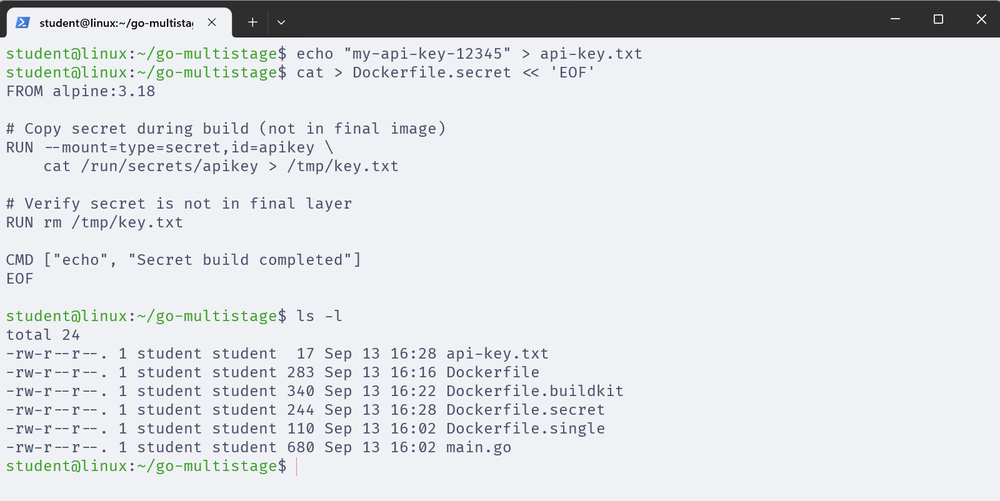

```bash
DOCKER_BUILDKIT=1 docker build --secret id=apikey,src=api-key.txt -t go-secret .
```

## Step 5: Verify secret not in image
```bash
docker history go-secret
```

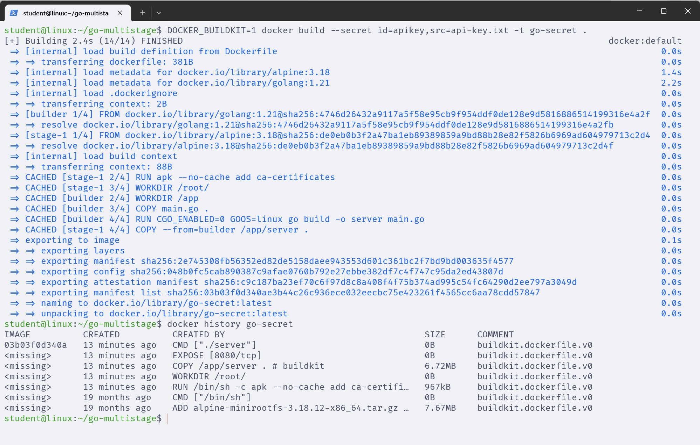

> **Note:** Secret is not visible in image history

---


# Lab 1.3: Image Analysis

## Step 1: Use docker history to inspect layers
```bash
docker history go-multi
docker history go-single
```

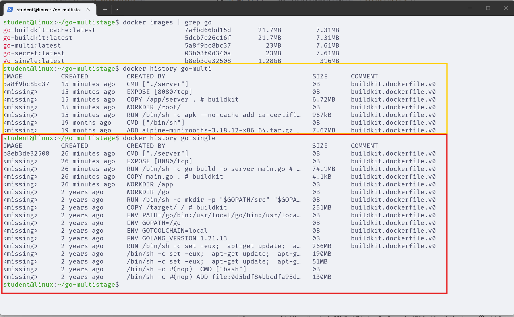

# 🧠 Try to answer Questions to Remember the Concept

Here are three questions designed to make the concept stick by connecting it to the data you just saw:

---

### ❓ Question 1: The "Why the Gap?" Question
**Your `go-single` image shows 1.28 GB disk usage but only 316 MB content size. Where did the other ~960 MB go?**

> **Hint to remember:** Think about compression. Content Size = compressed (what travels over the network). Disk Usage = uncompressed (what sits on your filesystem after `docker pull` unpacks it).

---

### ❓ Question 2: The "Spot the Culprit" Question
**Looking at `docker history go-single`, which layer is the biggest single contributor to the 1.28 GB, and why is that layer *completely absent* from `go-multi`?**

> **Hint to remember:** The 251MB `COPY /target/` layer is the entire Go toolchain/SDK from the `golang` base image. In a multi-stage build, that whole stage is thrown away — only the compiled binary (`COPY /app/server .` = 6.72MB) gets carried forward.

---

### ❓ Question 3: The "Real-World Tradeoff" Question
**If Content Size is what you download and Disk Usage is what you store, which one matters more when you're deploying to 1,000 servers vs. when you're building locally?**

> **Hint to remember:**
> - **Content Size** → matters for **network/CI/CD** (faster pulls across many machines, registry storage costs).
> - **Disk Usage** → matters for **local dev machines and nodes** (limited disk, many images cached).
> - Multi-stage wins on **both**: `go-multi` is 23 MB disk / 7.61 MB content vs. `go-single` at 1.28 GB / 316 MB — a **~55× disk** and **~40× content** reduction.

---

#### Step 2: Analyze image with dive tool (if installed)
```bash
# Install dive (optional)
# brew install dive  (macOS)
# sudo apt-get install dive  (Ubuntu)

DIVE_VERSION="0.13.1"
sudo dnf install -y \
  "https://github.com/wagoodman/dive/releases/download/v${DIVE_VERSION}/dive_${DIVE_VERSION}_linux_amd64.rpm"

```

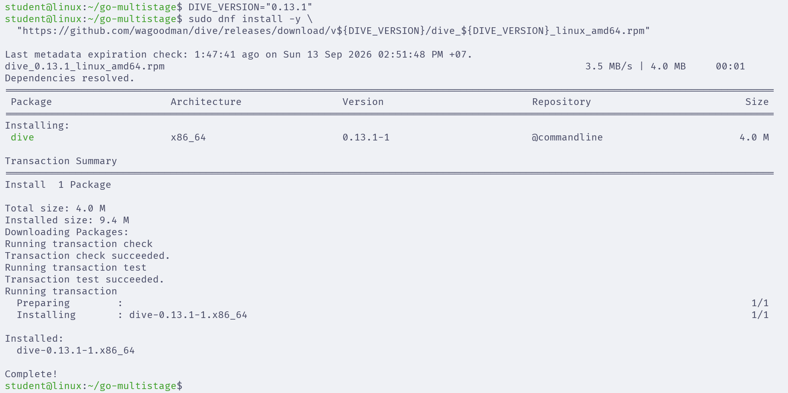

```bash
# Analyze image
dive go-multi
```


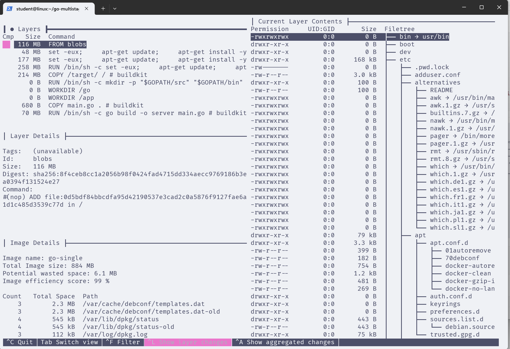

# 🧠Try to Answer Questions on the `dive` Command

Here are two questions designed to help you remember what `dive` does and why it's useful.

---

### ❓ Question 1: The "What Does It Show?" Question
**When you run `dive go-single:latest`, you see two panes: layers on the left and a file tree on the right. What specific insight does `dive` give you that `docker history` and `docker images` cannot?**

> **Hint to remember:**
> - `docker images` → only shows **total** disk/content size.
> - `docker history` → shows the **size of each layer** (the command that created it).
> - `dive` → shows **what files are inside each layer**, so you can pinpoint *exactly* which files are bloating the image (e.g., the entire Go SDK, `apt` caches, `.git` folders, test files).
>
> **Memory hook:** *"`docker history` tells you *how big* each layer is. `dive` tells you *why* it's big."*

---

### ❓ Question 2: The "Efficiency Score" Question
**`dive` gives your image an "Image Efficiency Score" (a percentage) and flags "wasted space." What do these two metrics actually measure, and what would a low score tell you to fix?**

> **Hint to remember:**
> - **Efficiency Score** = ratio of **useful files** (those present in the final layer) vs. **total files** ever added across all layers.
> - **Wasted Space** = files added in an earlier layer, then **deleted or overwritten** in a later layer (they still bloat the image).
> - **Low score → fix by:**
>   1. Using **multi-stage builds** (throw away the builder).
>   2. **Combining `RUN` commands** (e.g., `apt-get install && rm -rf /var/lib/apt/lists/*`).
>   3. Adding **`.dockerignore`** to keep junk out of `COPY`.
>
> **Memory hook:** *"A 100% efficient image has zero wasted bytes — every file added survives to the final layer."*

---

### 🔑 Combined memory hook:
> **"`dive` = X-ray for your image. It shows the *bones* (layers), the *organs* (files), and the *fat* (wasted space)."**

Want me to walk through a real `dive` session on your `go-single` vs `go-multi` images to see this in action?

## Step 3: Optimize .dockerignore
```bash
cat > .dockerignore << 'EOF'
.git
.gitignore
*.md
*.txt
api-key.txt
Dockerfile*
docker-compose*
.vscode
.idea
node_modules
__pycache__
*.pyc
EOF

```

## Step 4: Rebuild with optimized .dockerignore
```bash
DOCKER_BUILDKIT=1 docker build -t go-optimized .
docker images go-optimized
```

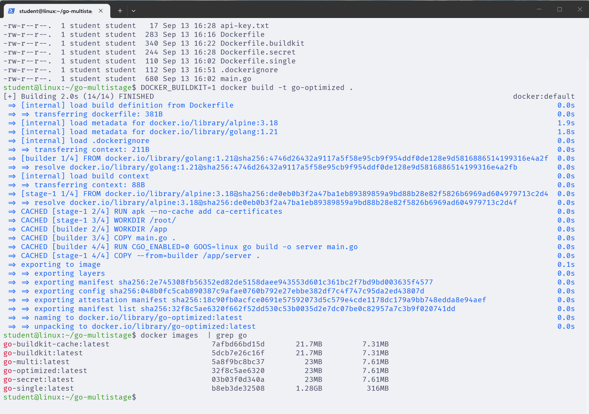

### without .dockerignore

```
Your folder (200 MB)  →  [pack everything]  →  BuildKit receives 200 MB
                                                    ↓
                                          Filters nothing, transfers everything
```


### with .dockerignore

```
Your folder (200 MB)  →  [filter patterns]  →  BuildKit receives 5 MB
                                                    ↓
                                          Only relevant files transferred
```

---


# Workshop 2: Container Internals

# Lab 2.1: Understanding Overlay Filesystem

## Step 1: Run container and examine filesystem
```bash
docker run -it --name overlay-test quay.io/centos/centos:stream10 /bin/bash
```

## Step 2: View overlay mount points (inside container)
```bash
mount | grep overlay
cat /proc/mounts | grep overlay
```

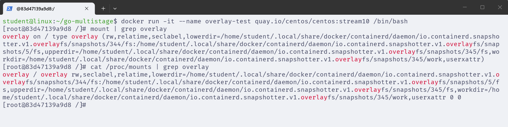

let break down output
```
overlay on / type overlay (
  rw,
  relatime,
  seclabel,
  lowerdir=<lower1>:<lower2>,
  upperdir=<upper>,
  workdir=<work>,
  userxattr
)
```

## Step 3: Create files in container
```bash
mkdir -p /test
echo "container file" > /test/file.txt
cat /test/file.txt
```

## Step 4: Exit and examine layers (on host)
```bash
exit
```

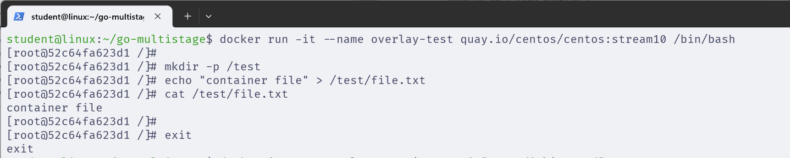

```bash
# run on host. Start container again
docker start overlay-test
docker ps

# Find container layer (on host)
cat /proc/$(docker inspect -f '{{.State.Pid}}' overlay-test)/mountinfo | grep overlay
```

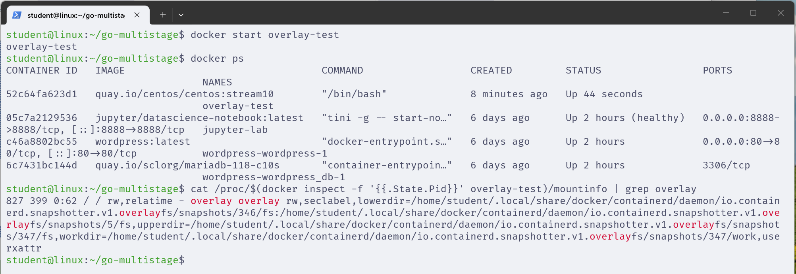

- explain output 
```
827 399 0:62 / / rw,relatime - overlay overlay rw,seclabel,
  lowerdir=
    /home/student/.local/share/docker/containerd/daemon/io.containerd.snapshotter.v1.overlayfs/snapshots/346/fs
    :
    /home/student/.local/share/docker/containerd/daemon/io.containerd.snapshotter.v1.overlayfs/snapshots/5/fs,
  upperdir=
    /home/student/.local/share/docker/containerd/daemon/io.containerd.snapshotter.v1.overlayfs/snapshots/347/fs,
  workdir=
    /home/student/.local/share/docker/containerd/daemon/io.containerd.snapshotter.v1.overlayfs/snapshots/347/work,
  userxattr
```


```
Container sees:  /test/file.txt  ✅ (unified view)

   ┌──────────────────────────────────────┐
   │         merged (/) in container      │
   └──────────────────────────────────────┘
                    ▲
        ┌───────────┼───────────┐
        │           │           │
   ┌────▼────┐ ┌────▼────┐ ┌────▼────┐
   │ 347/fs  │ │ 346/fs  │ │  5/fs   │
   │upperdir │ │lowerdir │ │lowerdir │
   │  (RW)   │ │  (RO)   │ │  (RO)   │
   │         │ │         │ │         │
   │ /test/  │ │ (empty) │ │ (empty) │
   │  file.txt│ │         │ │         │
   └─────────┘ └─────────┘ └─────────┘
       ▲
   YOUR WRITES
   go here
```

---

## 🧠 Summary Lab Step 4 Now Complete

| Lab Question | Answer |
|---|---|
| **Where is `upperdir`?** | `.../snapshots/347/fs` |
| **Where are `lowerdir`s?** | `.../snapshots/346/fs` and `.../snapshots/5/fs` |
| **Where is `workdir`?** | `.../snapshots/347/work` |
| **Why doesn't `docker inspect` show these?** | Modern Docker uses the **containerd snapshotter**, which hides internal paths behind `Storage.RootFS.Snapshot.Name` |
| **How to get them anyway?** | `cat /proc/$(docker inspect -f '{{.State.Pid}}' <name>)/mountinfo \| grep overlay` |

---

## 🎓 Bonus: Why `userxattr` Appears

The `userxattr` mount option means your Docker is running in **rootless mode** (or with user-namespace remapping). Instead of storing overlay metadata in `trusted.*` xattrs (which requires root), it stores them in `user.*` xattrs — accessible to unprivileged users.

That's why your paths live under `~/.local/share/docker/` instead of `/var/lib/docker/`. ✅

---

## Step 5: View layer contents (this will confuse if student run in rootmode, use ai to help)
```bash
# Find the overlay directory  root mode
sudo ls -la /var/lib/docker/overlay2/
```

```bash
# Find the overlay directory  root less
# The real Docker data root (rootless)
ls -la ~/.local/share/docker/

# Where layers actually are
ls ~/.local/share/docker/containerd/daemon/io.containerd.snapshotter.v1.overlayfs/snapshots/

# Your container's config + logs
ls ~/.local/share/docker/containers/

# Where to find images
ls ~/.local/share/docker/containerd/daemon/io.containerd.content/
```

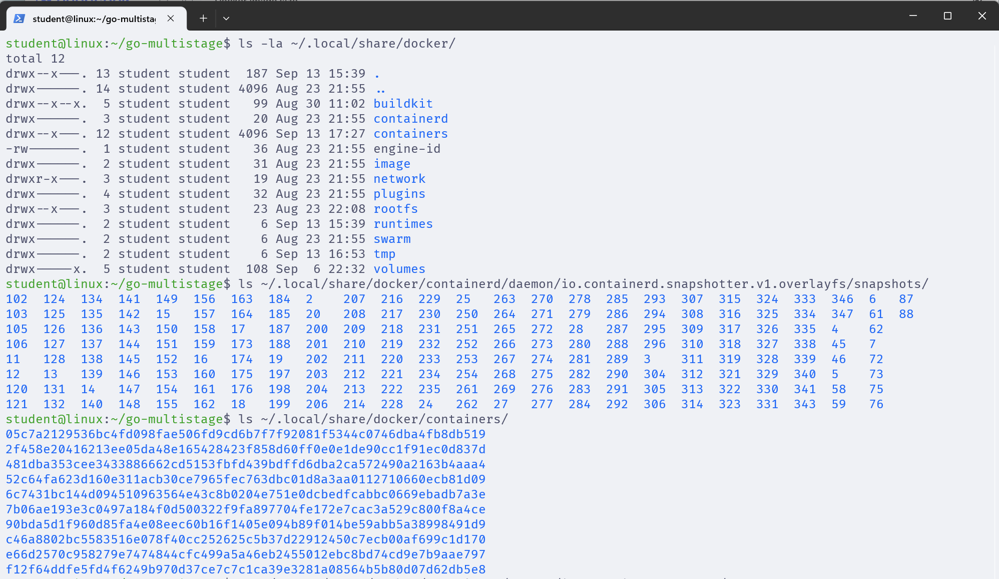

## Step 6: Compare container vs image layers
```bash
docker diff overlay-test
docker commit overlay-test overlay-test-snapshot
docker history overlay-test-snapshot
```

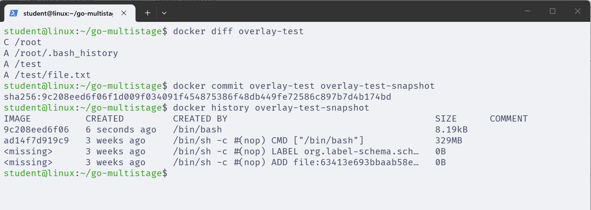

---

[Reading Diff Explaination](./06-diff-explain.md)

# Lab 2.2: Resource Limits

## Step 1: Run container with memory limit
```bash
docker run -d --name memory-limit \
  --memory=256m \
  quay.io/centos/centos:stream10 \
  tail -f /dev/null

docker stats memory-limit --no-stream
```

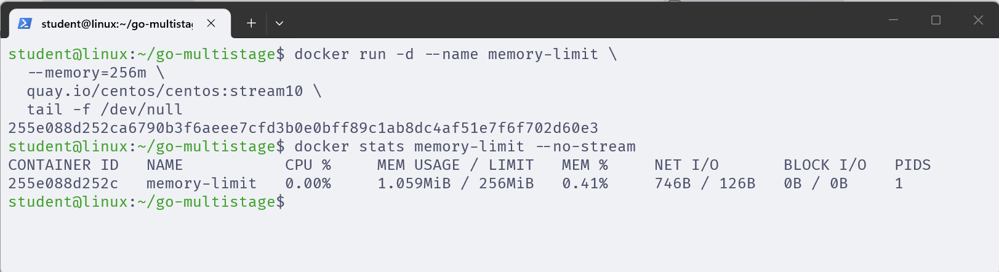

## Step 2: Run container with CPU limit
```bash
docker run -d --name cpu-limit \
  --cpus=0.5 \
  quay.io/centos/centos:stream10 \
  tail -f /dev/null

docker stats cpu-limit --no-stream
```

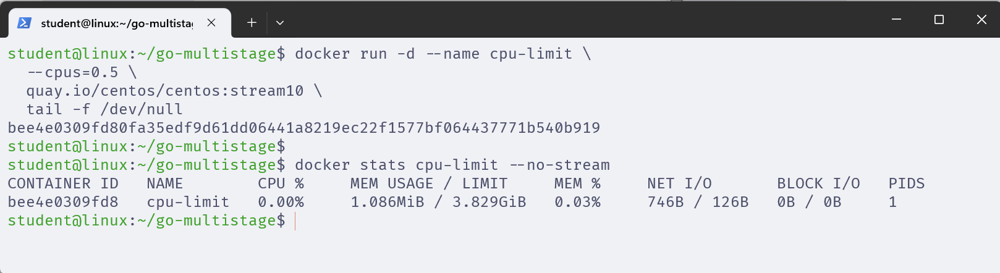

## Step 3: Run container with PID limit
```bash
docker run -d --name pid-limit \
  --pids-limit=50 \
  quay.io/centos/centos:stream10 \
  tail -f /dev/null

# Test PID limit (optional - may fail)
docker exec pid-limit sh -c 'for i in $(seq 1 100); do sleep 100 & done'
```

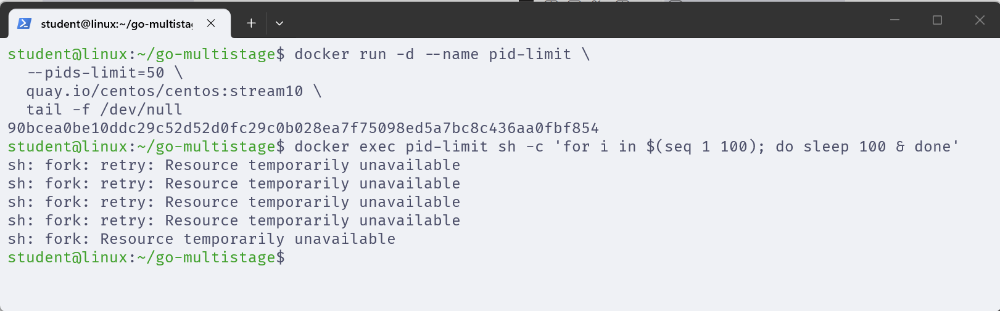

## Step 4: Monitor resource usage
```bash
docker stats --no-stream
```

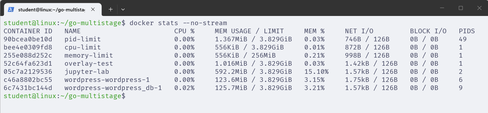

## Step 5: Combine resource limits
```bash
docker run -d --name combined-limit \
  --memory=128m \
  --cpus=0.25 \
  --pids-limit=25 \
  quay.io/centos/centos:stream10 \
  tail -f /dev/null

docker stats combined-limit --no-stream
```

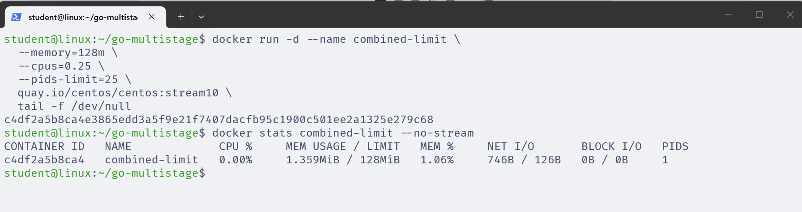


---

# Lab 2.3: Container Inspection

## Step 1: Use docker inspect
```bash
docker inspect combined-limit
docker inspect --format='{{.HostConfig.Memory}}' combined-limit
docker inspect --format='{{.HostConfig.NanoCpus}}' combined-limit
```

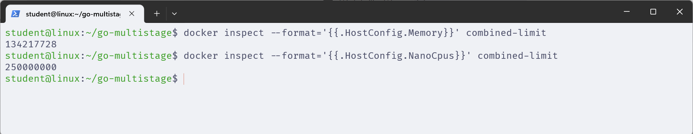

## Step 2: View container logs
```bash
docker logs overlay-test
docker logs -f overlay-test  # Follow logs , keep listen, Ctrl+C to exit
docker logs --tail 10 overlay-test  # Last 10 lines
```

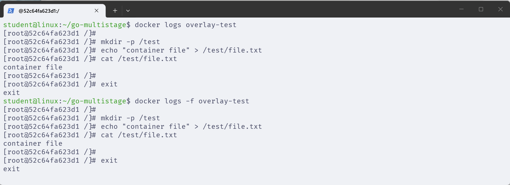

## Step 3: Use docker stats with
```bash
docker stats --no-stream --format "table {{.Name}}\t{{.CPUPerc}}\t{{.MemUsage}}"
```

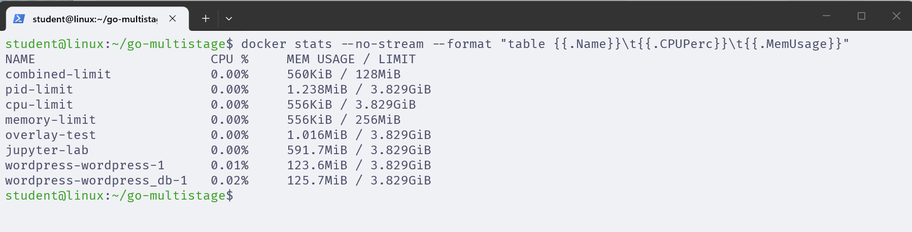

## Step 4: Use docker top
```bash
docker top combined-limit
docker top combined-limit -o pid,comm
```

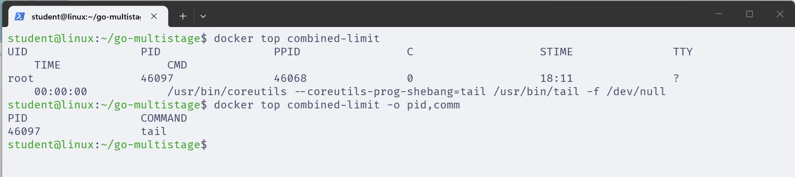

## Step 5: Use docker diff
```bash
docker exec combined-limit touch /tmp/test-file
docker diff combined-limit
```
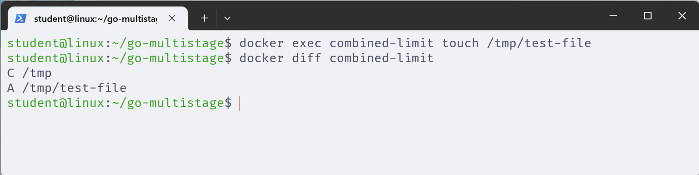

---

# Workshop 3: Advanced Networking
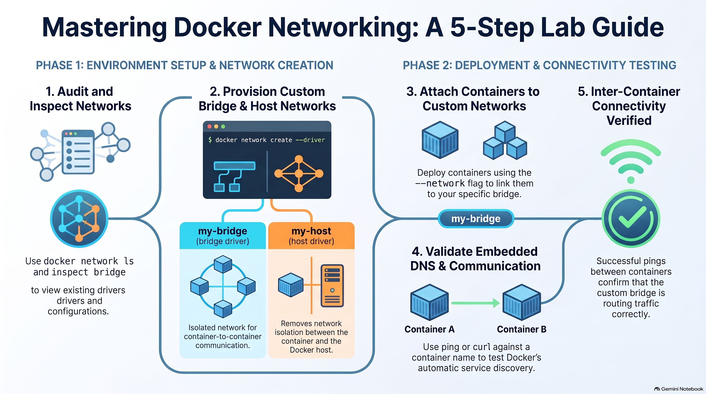

# Lab 3.1: Docker Network Types

## Step 1: List default networks
```bash
docker network ls
docker network inspect bridge
```
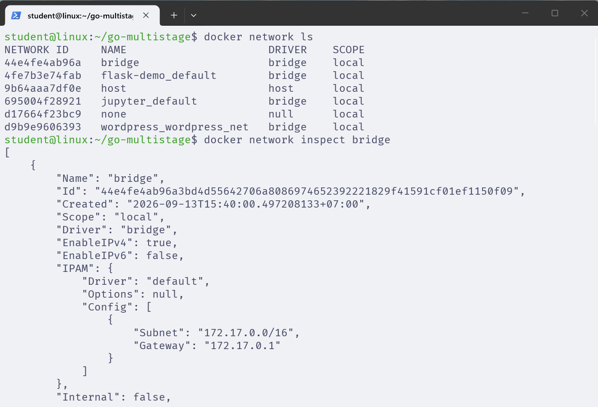

## Step 2: Create bridge network
```bash
docker network create --driver bridge my-bridge
docker network ls | grep my-bridge
```

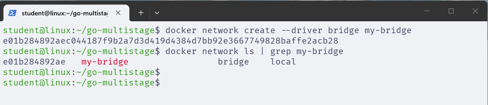

## Step 3: Create host network
```bash
docker network create --driver host my-host
docker network ls | grep my-host
```

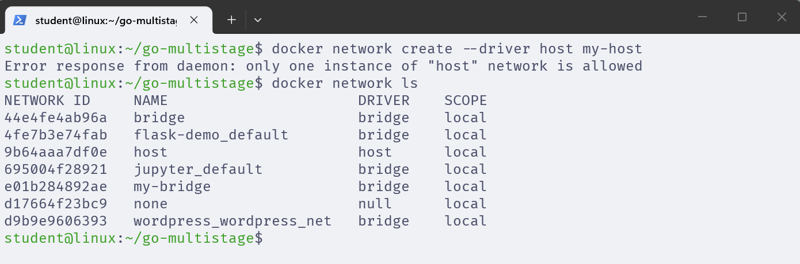

## Step 4: Connect containers to custom network
```bash
# Run 2 containers on custom network
docker run -d --name net-test-1 --network my-bridge quay.io/centos/centos:stream10 tail -f /dev/null

docker run -d --name net-test-2 --network my-bridge quay.io/centos/centos:stream10 tail -f /dev/null
```

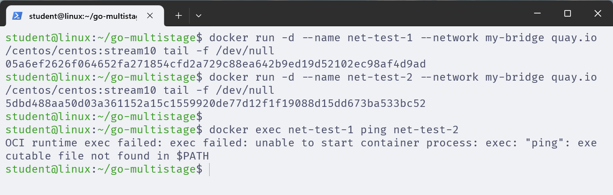

no ping command: run
```bash
docker exec -it net-test-1 bash -c "dnf install -y iputils && ping -c 3 net-test-2"
```

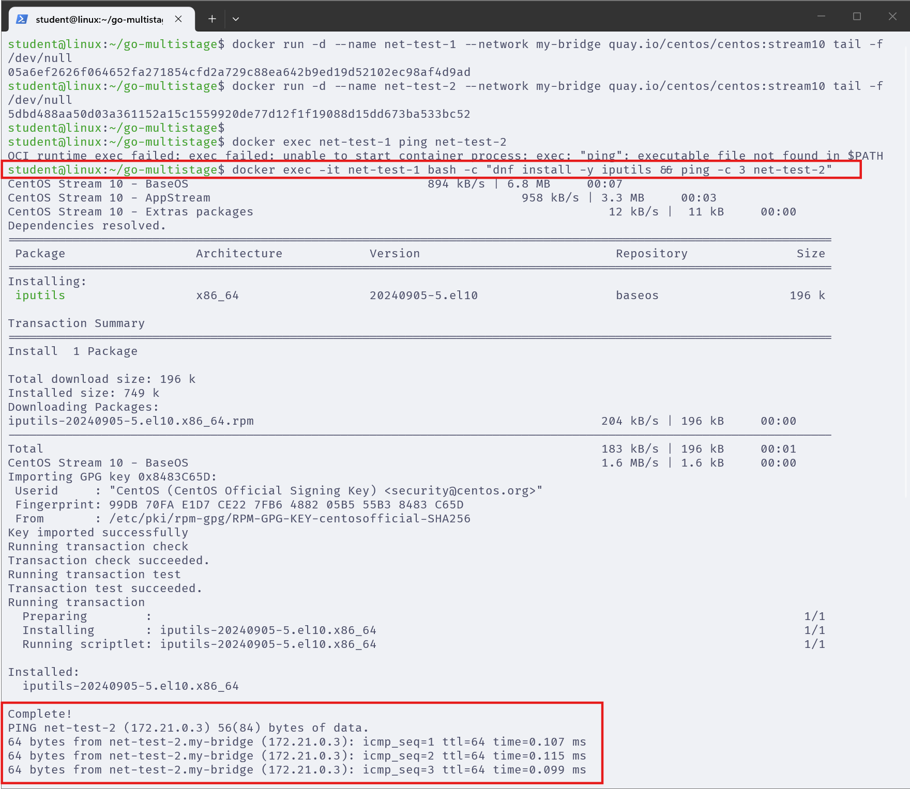

## Step 5: Test inter-container communication
```bash
# Test DNS resolution
docker exec net-test-1 ping net-test-2

# Test connectivity
docker exec net-test-1 curl net-test-2
```

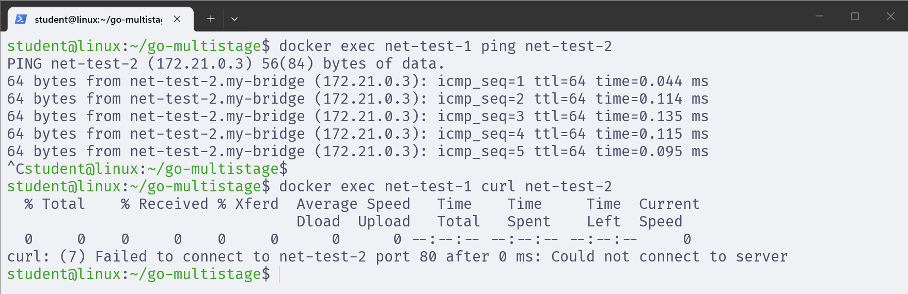

---

# Lab 3.2: Port Mapping and Exposing

## Step 1: Run container with -p flag
```bash
docker run -d --name port-test -p 8080:80 quay.io/sclorg/httpd-24-c10s
curl http://localhost:8080
```

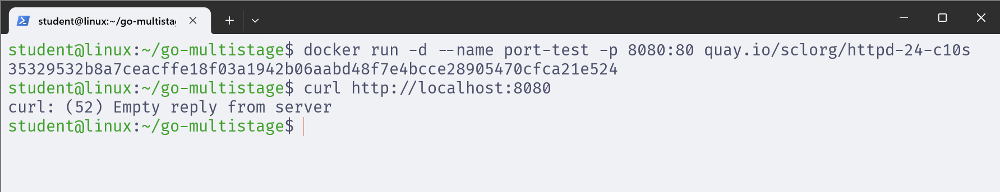


## Step 2: Run container with -P flag
```bash
docker run -d --name port-random -P quay.io/sclorg/httpd-24-c10s
docker port port-random
```

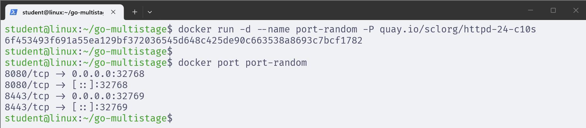

## Step 3: Use docker port command
```bash
docker port port-test
docker port port-test 80
```

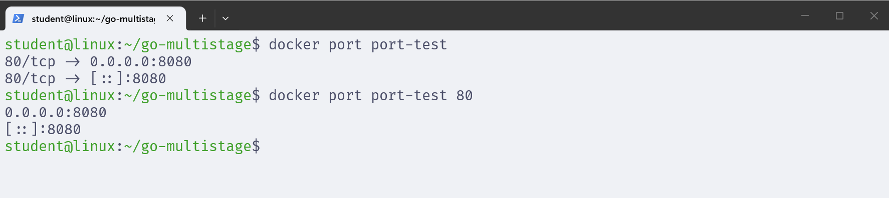

## Step 4: Configure port forwarding
```bash
# Bind to specific interface
docker run -d --name port-bind-2 -p 127.0.0.1:9092:80 quay.io/sclorg/httpd-24-c10s
curl http://127.0.0.1:9092
```


# Lab 3.3: Upload Image to Docker Hub

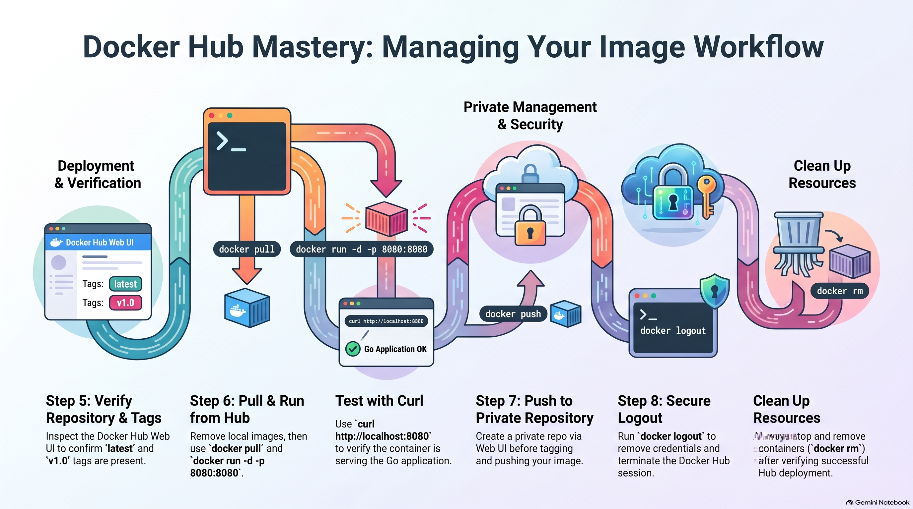
## Step 1: Create a Docker Hub account
```
Go to https://hub.docker.com and sign up for a free account.
Note your Docker Hub username (e.g., myuser).
```
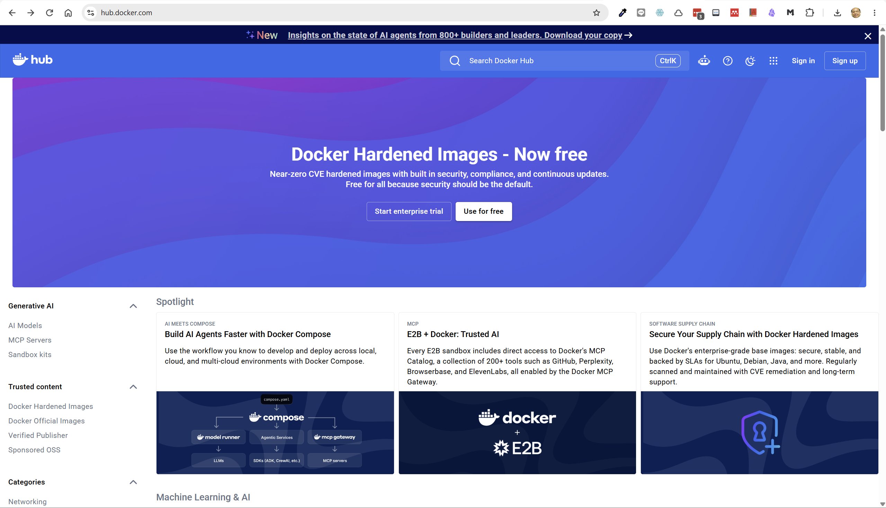

## Step 2: Login to Docker Hub from CLI
```bash
docker login
# Enter your Docker Hub username
# Enter your Docker Hub password or access token
```
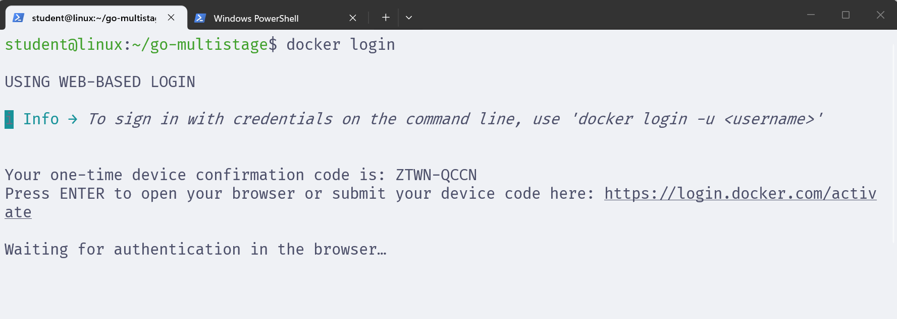

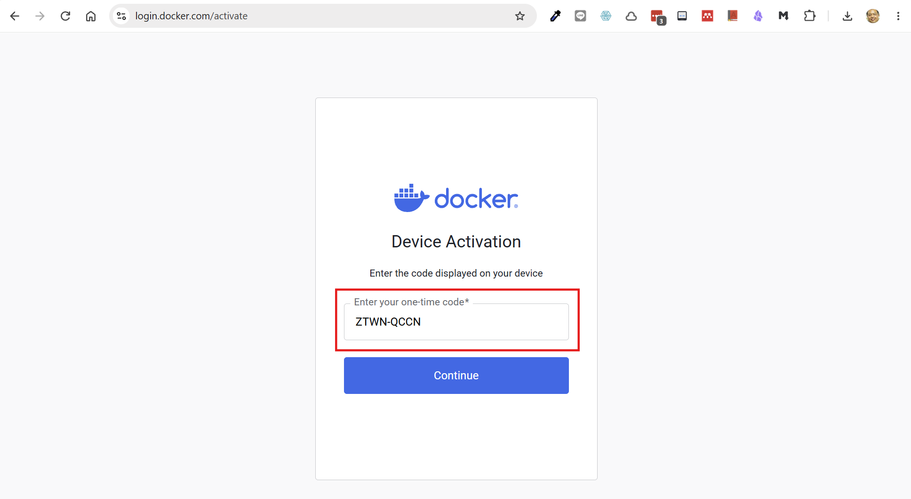

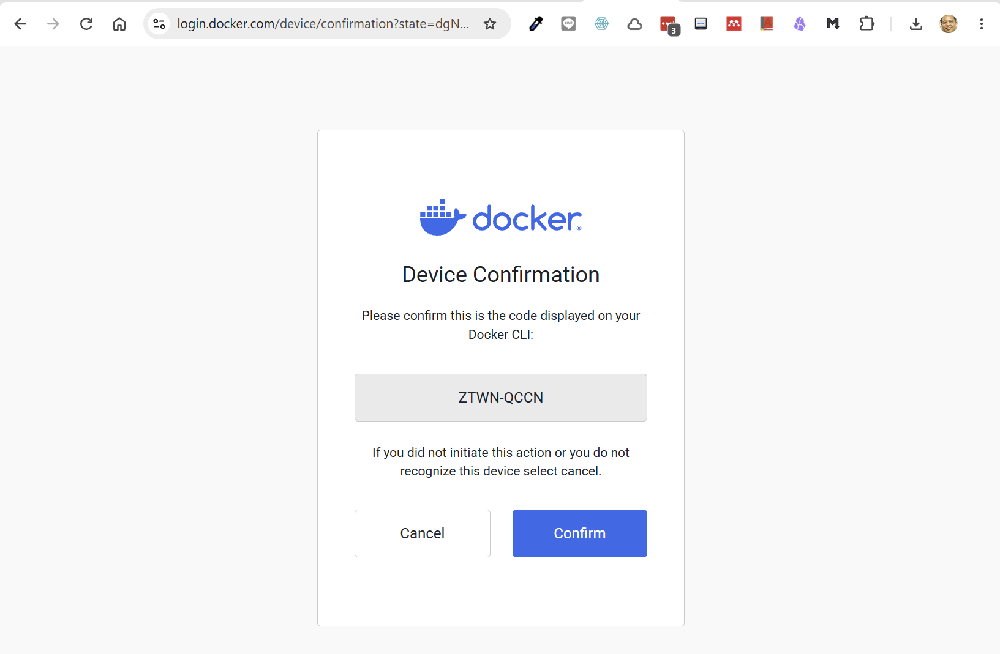

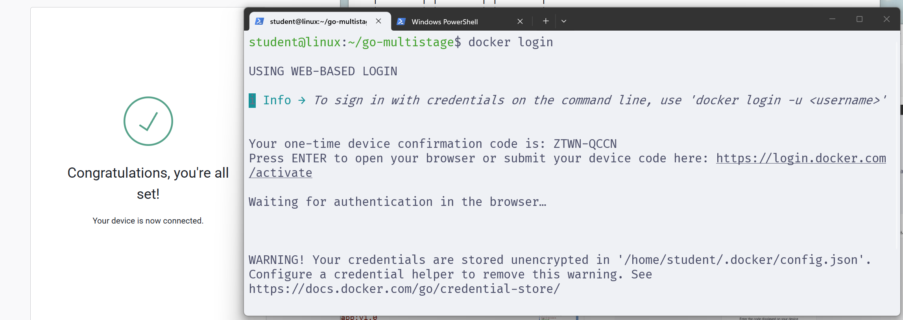

> **Note:** A successful login shows `Login Succeeded`

student also log in to website:

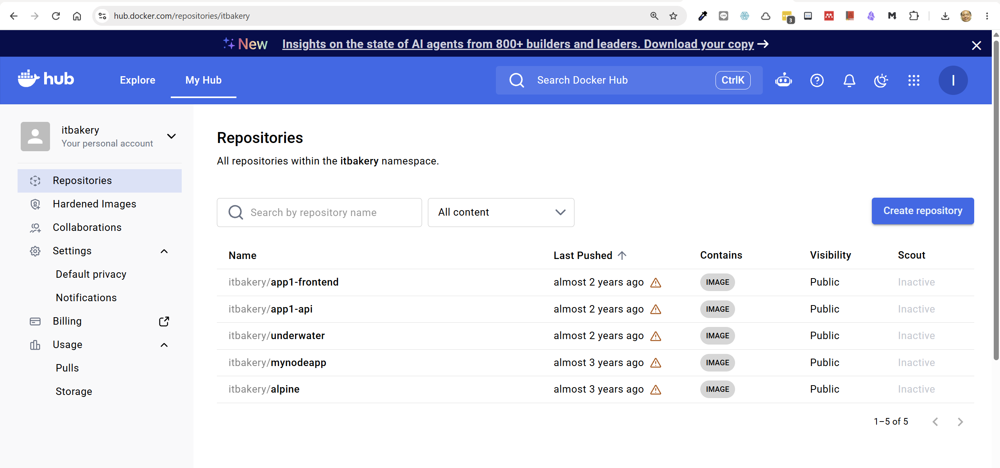

## Step 3: Tag your image for Docker Hub
```bash
# Tag the Go app image from previous lab
docker tag go-multi <your-username>/go-app:latest
docker tag go-multi <your-username>/go-app:v1.0

# Verify tags
docker images | grep <your-username>
```

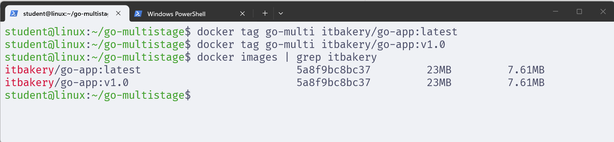

> **Note:** Replace `<your-username>` with your actual Docker Hub username.

## Step 4: Push image to Docker Hub
```bash
# Push latest tag
docker push <your-username>/go-app:latest

# Push version tag
docker push <your-username>/go-app:v1.0
```


> **Note:** First push may take a few minutes depending on image size and network speed.

## Step 5: Verify on Docker Hub
```
Go to https://hub.docker.com/repositories
Your image should appear under your repositories.
Check the Tags tab to see both latest and v1.0 tags.
```


Click image name, will show each of version of image


## Step 6: Pull image from Docker Hub
```bash
# Remove local image
docker rmi <your-username>/go-app:latest <your-username>/go-app:v1.0

# Pull from Docker Hub
docker pull <your-username>/go-app:latest

```


```bash
# Run the pulled image
docker run -d --name hub-app -p 8080:8080 <your-username>/go-app:latest
curl http://localhost:8080
```


- image above show how to fix error too.

```bash
# Cleanup

docker stop hub-app
docker rm hub-app
```


## Step 7: Push a private image

create private repository


- Dont forget to select private


```bash
# Create a private repository on Docker Hub (via web UI)
# Then tag and push
docker tag go-multi <your-username>/go-app-private:latest
docker push <your-username>/go-app-private:latest
```


> **Note:** Free accounts can have 1 private repository. Upgrade for more.


## Step 8: Logout from Docker Hub
```bash
docker logout
```

---

--- ## Lab end here ---
## Reading Note: Docker Advanced Commands  (options)

### Advanced Docker Commands Cheat Sheet

| Command | Purpose |
|---------|---------|
| `docker buildx build` | Build with BuildKit builder |
| `docker buildx ls` | List available builders |
| `docker system df` | Show Docker disk usage |
| `docker system prune` | Remove unused data |
| `docker system prune -a` | Remove all unused data |
| `docker inspect` | Return container/image details |
| `docker stats` | Display resource usage |
| `docker top` | Display running processes |
| `docker diff` | Inspect changes in container |
| `docker logs` | Fetch container logs |
| `docker port` | List port mappings |
| `docker network ls` | List networks |
| `docker network inspect` | Inspect network details |
| `docker scout cves` | Scan for vulnerabilities |

---

## Quiz

❓ question "Question 1: What is the benefit of multi-stage builds?"
    **Answer:**
    
    Multi-stage builds reduce final image size by separating build dependencies from runtime dependencies. The build stage contains compilers and tools, while the final stage contains only the application and minimal runtime.

❓ question "Question 2: How do you enable BuildKit?"
    **Answer:**
    
    Set the environment variable `DOCKER_BUILDKIT=1` or configure Docker daemon with BuildKit enabled.

❓ question "Question 3: What is the overlay filesystem in Docker?"
    **Answer:**
    
    Overlay filesystem (overlay2) is a union filesystem that combines multiple directories (layers) into a single unified view. Docker uses it to efficiently store container layers with Copy-on-Write (CoW).

❓ question "Question 4: How do you limit container memory?"
    **Answer:**
    
    Use the `--memory` flag: `docker run --memory=256m image_name`

❓ question "Question 5: What is the difference between -p and -P?"
    **Answer:**
    
    `-p` maps specific host port to container port (e.g., `-p 8080:80`), while `-P` publishes all exposed ports to random host ports.

❓ question "Question 6: How do you create a custom Docker network?"
    **Answer:**
    
    Use `docker network create --driver bridge network_name`

❓ question "Question 7: What is the purpose of .dockerignore?"
    **Answer:**
    
    `.dockerignore` excludes files and directories from the build context, reducing build time and preventing sensitive files from being copied into the image.

❓ question "Question 8: How do you run a container with CPU limits?"
    **Answer:**
    
    Use the `--cpus` flag: `docker run --cpus=0.5 image_name` (limits to 50% of one CPU core)

❓ question "Question 9: What is a Docker private registry?"
    **Answer:**
    
    A private registry is a self-hosted Docker image storage service that allows you to store and distribute Docker images privately within your organization.

❓ question "Question 10: How do you inspect container resource limits?"
    **Answer:**
    
    Use `docker inspect --format='{{.HostConfig.Memory}}' container_name` or `docker stats` for real-time monitoring.


---