# Chapter 7: Workshop 2 - Portainer (Visual Docker Management on CentOS Stream 10)

## How to Install Portainer CE with Docker on Linux

Managing Docker containers using the command line can be challenging, especially for beginners, which is why Portainer CE (Community Edition) is a free, lightweight, and user-friendly tool that simplifies Docker management by providing a web-based interface, allowing you to efficiently manage containers, images, networks, and volumes without manually running long terminal commands.


## Overview

This is **Workshop 2** of the capstone. In Workshop 1 you built, shipped, and redeployed the
**Campus Café** application entirely from the command line. In this workshop you keep the same
application but change the **management interface**: you install **Portainer CE** — an open-source
web UI for Docker — on the **CentOS Stream 10** server and use it to:

- Inspect containers, images, volumes, and networks your CLI sessions already created
- Deploy new stacks **from the browser** (web editor and templates)
- Perform daily operations: logs, console (exec), restart, cleanup
- Understand the security trade-off of mounting the Docker socket into a container

```
   YOUR BROWSER (Windows PC)
   https://<server-ip>:9443
          │
          ▼  HTTP/HTTPS (Portainer web UI)
   ┌───────────────────────────────────────────────┐
   │  CentOS Stream 10 server (rootless Docker)    │
   │                                               │
   │  ┌───────────────┐   /var/run/docker.sock     │
   │  │  Portainer    │ ─────────────────────► ┌─────────────┐
   │  │  portainer-ce │      (API control)     │ dockerd     │
   │  └───────────────┘                        │ (rootless)  │
   │        :9443 / :8000                      └──────┬──────┘
   │                                                 │ manages
   │   ┌───────────┬───────────┬────────┬─────────┐  │
   │   ▼           ▼           ▼        ▼         ▼  ▼
   │  cafe-web   cafe-api    cafe-db  cafe-redis  demo stacks
   └─────────────────────────────────────────────────────────┘
```

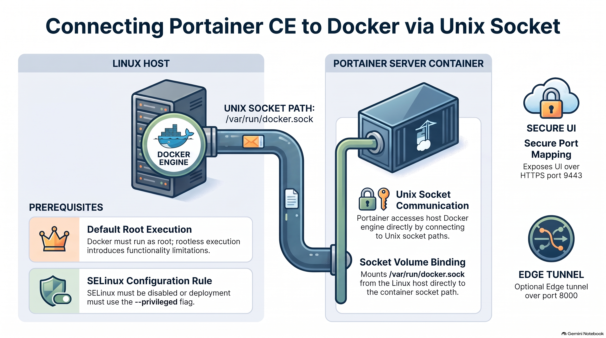
Figure Explain Portainer Web management to docker 

### Objectives
- Can install Portainer CE as a container, including the correct **rootless** socket path
- Can open the firewall and reach the UI from a browser on your own machine
- Can explain why mounting `docker.sock` into Portainer is powerful **and** dangerous
- Can deploy a stack from the browser (web editor + template) without touching the CLI
- Can operate an existing stack (logs, console, restart, prune) through the UI
- Can compare CLI `docker compose` workflow vs Portainer Stacks workflow

---

### Why Portainer Needs This Bind Mount
Portainer Server runs inside its own isolated Docker container
. To act as a centralized management dashboard for your system, it must be able to inspect and control the host's Docker engine
:
- Direct Host Daemon Control: Without mounting docker.sock, Portainer would be trapped inside its own isolated container with no awareness of the other containers or resources on the host machine.
- Real-Time Monitoring: Mounting the socket allows Portainer to continuously stream live container metrics, health status, and logs directly from the Docker daemon.
- Executing Commands via Web UI: When you perform an action in Portainer's web dashboard (such as creating a new container or restarting a stack), Portainer sends the REST API command to /var/run/docker.sock inside the container
. Thanks to the bind mount, the host's Docker daemon receives and executes that instruction immediately on the host host system

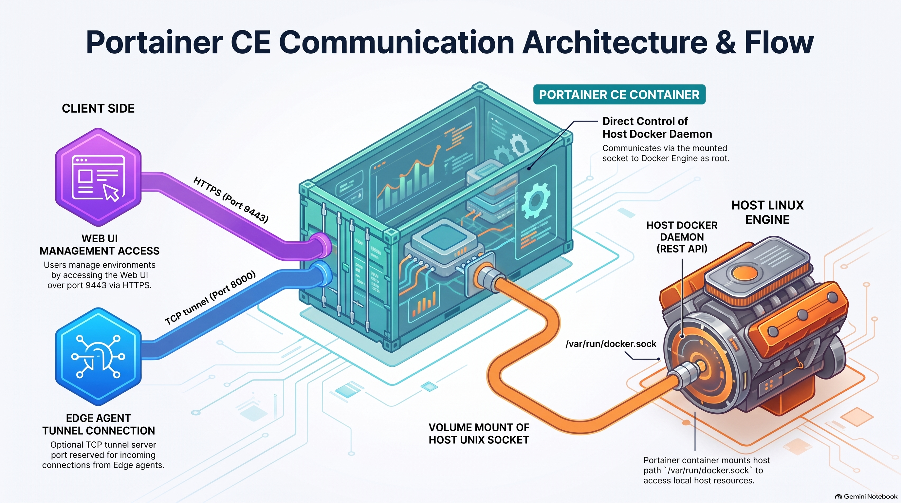

[Reading What is linux socket. Click  more..](./07-what-is-sock.md)


---

## 7.1 Prerequisites

| Item | Value |
|------|-------|
| Server | CentOS Stream 10, same VM as Chapters 4–6 and Workshop 1 |
| Docker | Docker CE installed, **rootless mode** active (Chapter 2, section 2.8) |
| Running app | Campus Café from Workshop 1 Part A (`cafe-web`, `cafe-api`, `cafe-db`, `cafe-redis`) |
| Images pushed | `<your-dockerhub-username>/cafe-web:latest` and `cafe-api:latest` on Docker Hub (Workshop 1 Part B) |
| Ports used by this workshop | `9443` (HTTPS UI), `8000` (edge/tunnel), `8081`–`8082` (demo stacks) |

Quick sanity check before you start:

```bash
# Root mode daemon
systemctl status docker
# Rootless daemon must be running
systemctl --user status docker --no-pager

# The socket your commands actually talk to
ls -l /run/user/$(id -u)/docker.sock

# Café should still be up from Workshop 1
cd cafe-app
docker compose -p cafe-app ls 2>/dev/null || docker ps --format "{{.Names}}"
```
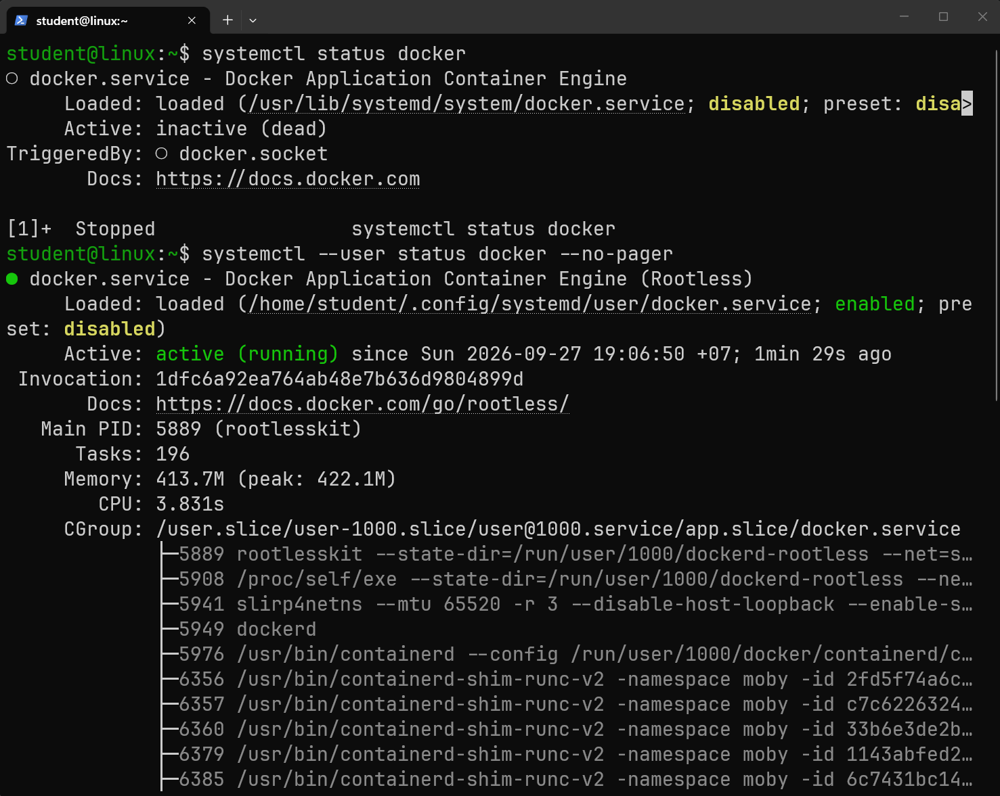
Figture check docker service

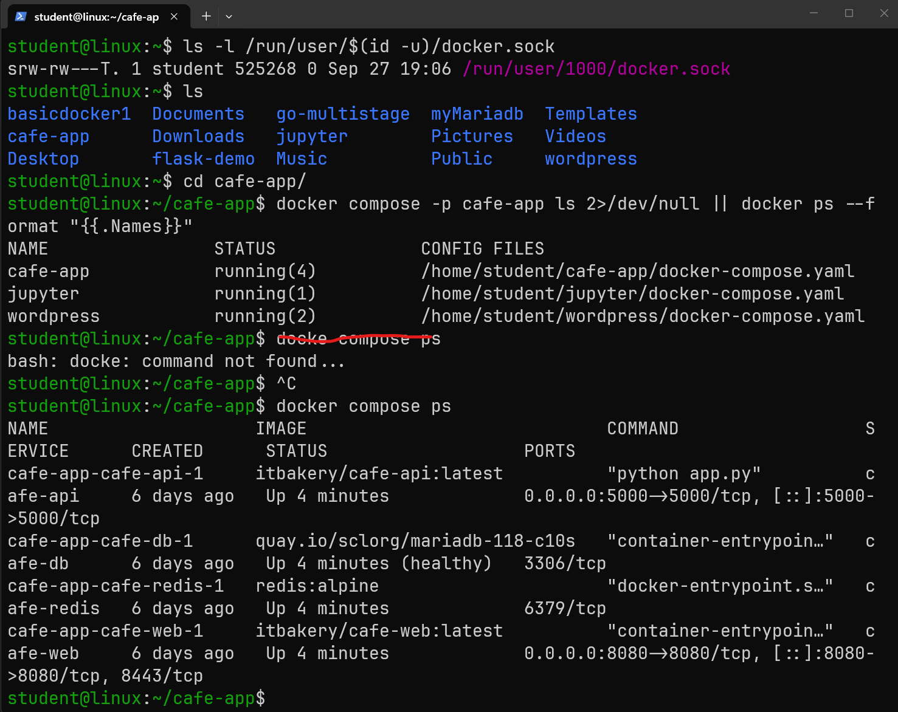
Figture start cafe-app

Expected: `active (running)` for the user docker service, a socket file owned by **your user**
(not root), and four `cafe-*` containers listed.

---

## 7.2 Part A - Install Portainer CE

> **Why does Portainer need the socket?** (Chapter 2 concept)
> Portainer is just another container. To control Docker it needs the Docker **API**.
> By bind-mounting the daemon socket into the container
> (`-v ...docker.sock:/var/run/docker.sock`), the Portainer process inside the container can send
> REST API requests to `dockerd` on the host — the same channel your `docker` CLI uses.
>
> **Security warning:** a container holding the Docker socket can create privileged containers and
> therefore effectively controls the host. Only run Portainer from an image you trust, keep it on a
> private network, and set a strong admin password. In rootless mode the blast radius is much
> smaller: the "host" it controls is already an unprivileged user namespace owned by **you**.

### Step 1: Create the data volume

Portainer stores its own database (users, stacks definitions, settings) in a named volume so the
data survives container upgrades:

```bash
docker volume create portainer_data
docker volume ls | grep portainer
docker volume inspect portainer_data
```
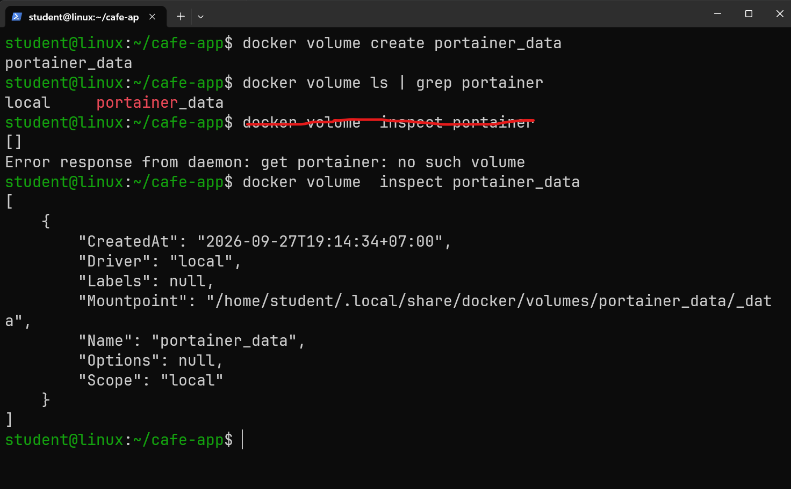

### Step 2: Run the Portainer container
now time to start portainer web ui
```bash
docker run -d \
  -p 9443:9443 \
  -p 8000:8000 \
  --name portainer \
  --restart=unless-stopped \
  -v /run/user/$(id -u)/docker.sock:/var/run/docker.sock \
  -v portainer_data:/data \
  portainer/portainer-ce:latest
```

## note if you want to restart container just use name
```bash 
# restart portainer
docker restart portainer
```
### if Student how use rooless, use docker run in **note 1** below
> **Rootless socket note:** in rootless Docker, container `root` is mapped to **your host user**
> inside a user namespace, so Portainer can read `/run/user/1000/docker.sock` — which is owned by
> you. If your Docker is **rootful** (you skipped Chapter 2 section 2.8), replace the socket line
> with `/var/run/docker.sock:/var/run/docker.sock`.

Check it started:

```bash
docker ps --filter name=portainer
curl -sk https://localhost:9443 -o /dev/null -w "%{http_code}\n"
```

Expected: container `Up`, HTTP code `200`.

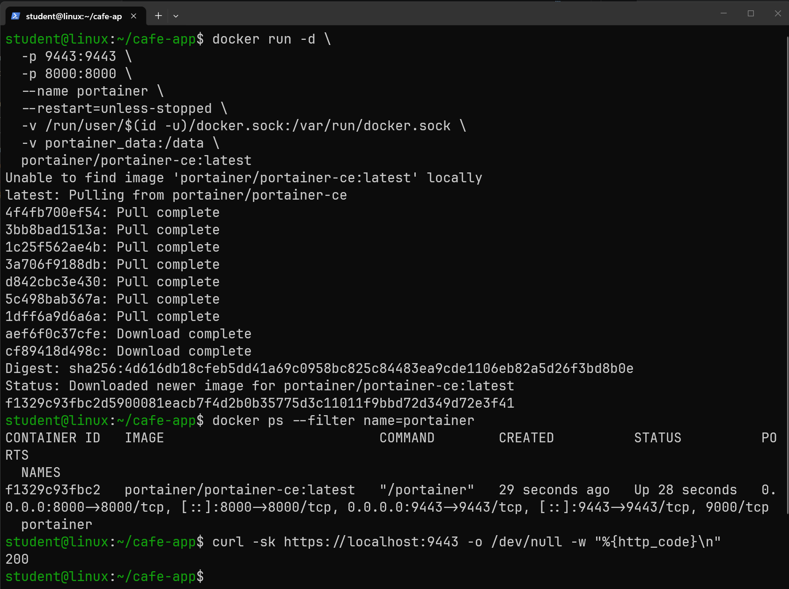

### Step 3: Open the firewall

```bash
sudo firewall-cmd --permanent --add-port=9443/tcp
sudo firewall-cmd --permanent --add-port=8000/tcp
sudo firewall-cmd --reload
sudo firewall-cmd --list-ports
```
Expected output includes `8000/tcp 9443/tcp` (plus your café ports `5000/tcp 8080/tcp`).

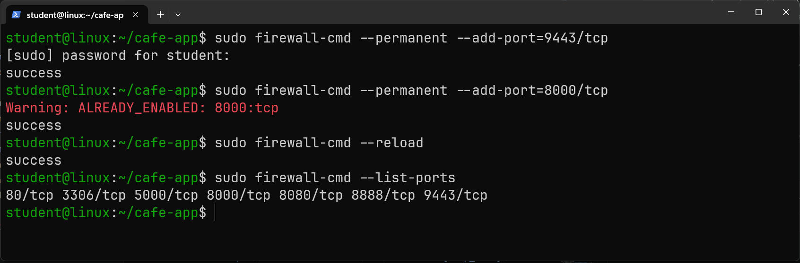

---

## 7.3 Part B - First Login and UI Tour

**Logging In**

Now that the installation is complete, you can log into your Portainer Server instance by opening a web browser and going to:

### Task B1: Create the admin user

```bash
# run 
ip a

# ss -tulpn  check opening port
ss -tulpn 
```

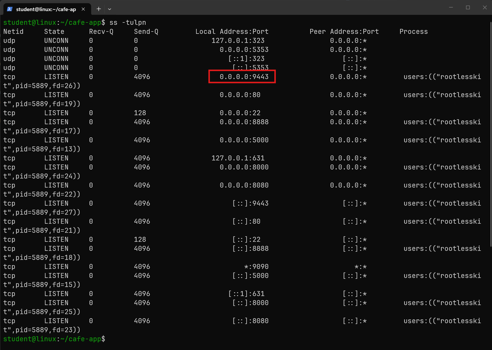

1. On your **Windows PC** browser open: `https://<server-ip>:9443`

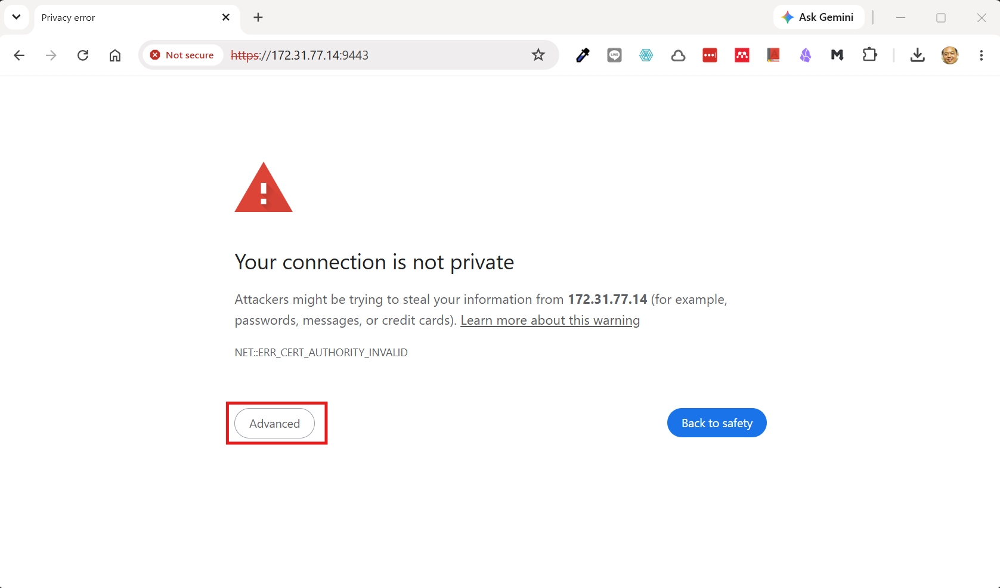
- because of portainer use self-cert , click advanced to manual accept
-
2. Accept the self-signed certificate warning (**Advanced → Continue**).


l
3. The **Create admin user** screen appears. **You have only 5 minutes** — this screen closes
   automatically if nobody claims the instance (prevents strangers grabbing your install).
4. Enter username `admin` (or your student id) and a strong password (12+ chars recommended),
   then **Create user**.

You land on **Environments → Local environment**. Modern Portainer CE bundles its agent inside the
main container, so the local Docker environment should show **state: Up-to-date** immediately.

```bash
# run command to get token, save token value in notepad
docker logs portainer
```

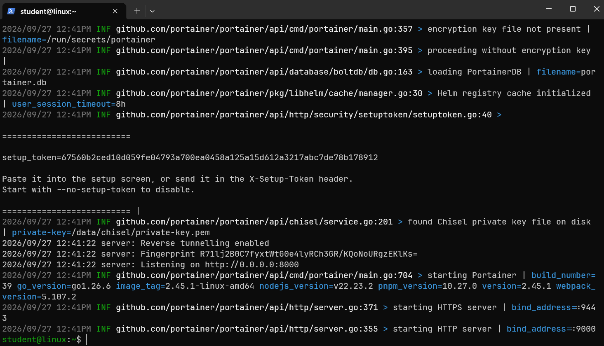

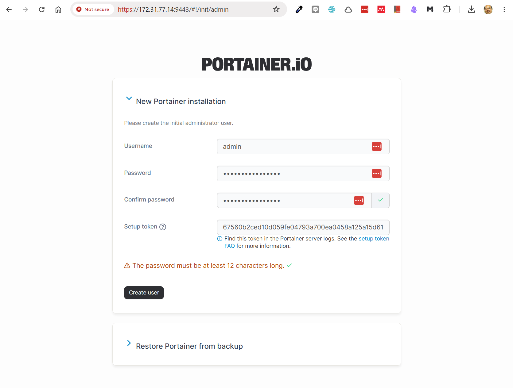

- student can use   admin ^1XCxiU@aA5hYuxF

if web screen show  
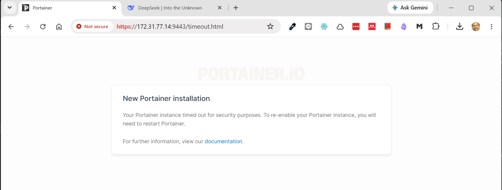

this mean time out, need to run 
```bash
docker restart portainer
```

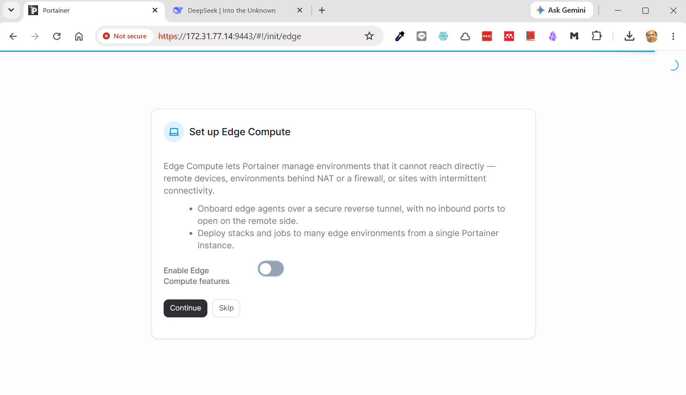
- Click continue, do not select Edge option

## Note 1 for use docker in rootless mode (skip if not rootless)

> If your version instead shows an "Add environment" wizard asking you to run an agent, choose
> **Docker** and follow the generated command — adapted for rootless it looks like:
> ```bash
> docker run -d --name portainer_agent --restart=unless-stopped \
>   -v /run/user/$(id -u)/docker.sock:/var/run/docker.sock \
>   -v ~/.local/share/docker/volumes:/var/lib/docker/volumes \
>   portainer/agent:latest
> ```
> (Rootless stores Docker data under `~/.local/share/docker`, not `/var/lib/docker`.)

**Screenshot:** the Environments list showing `local` environment healthy.

### Task B2: Portainder view

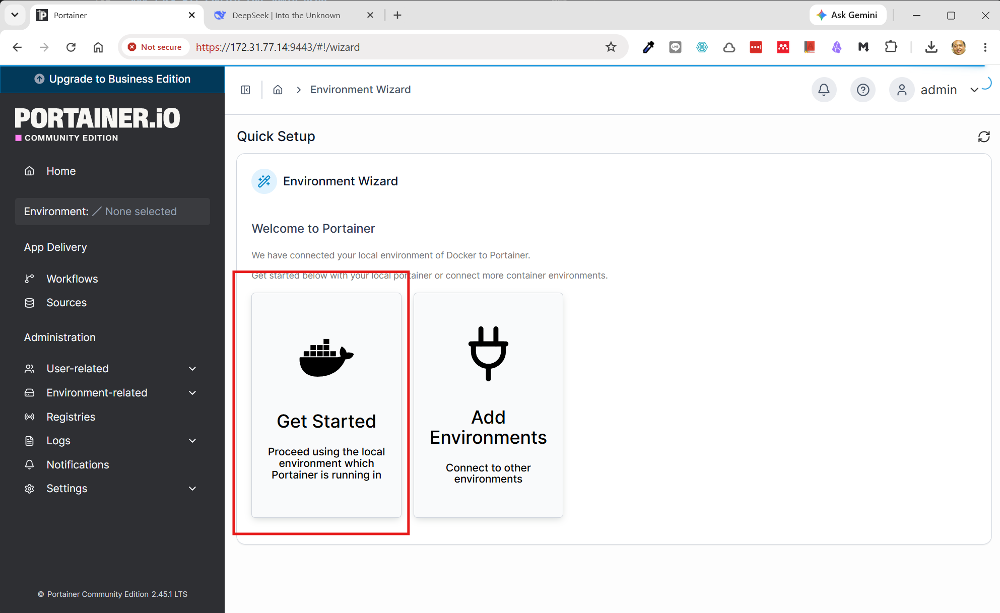

Left menu: **Get Started**.

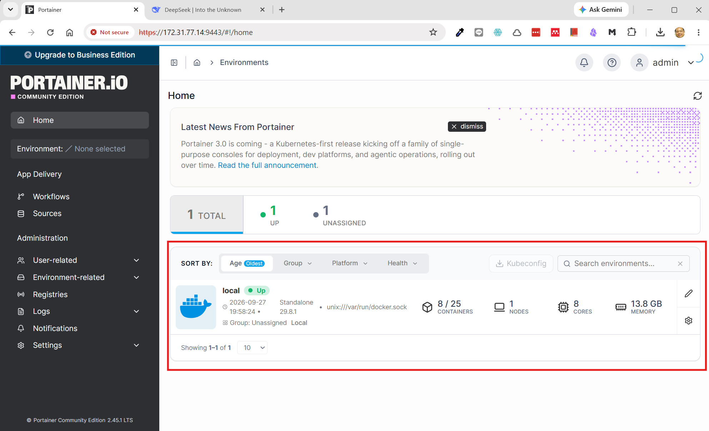

Click local environment

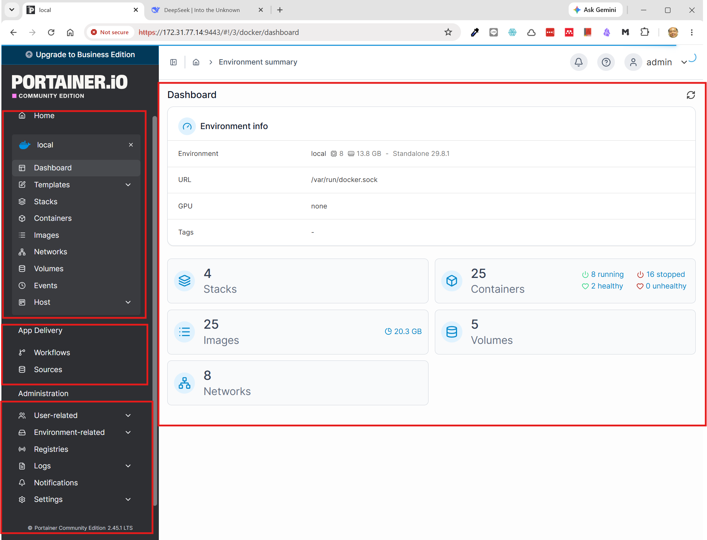

You will see web gui desktop

if you select there are list of application container 

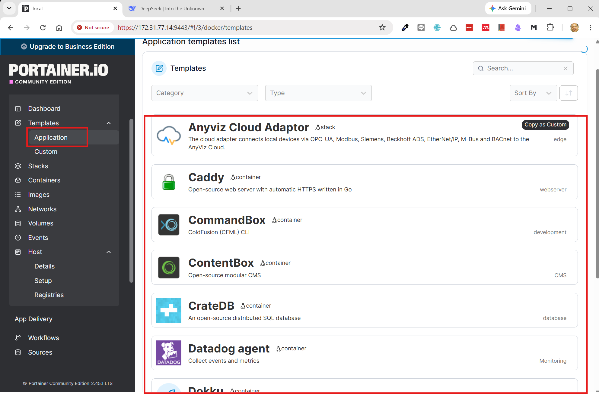


if you select container it will show container with run in local

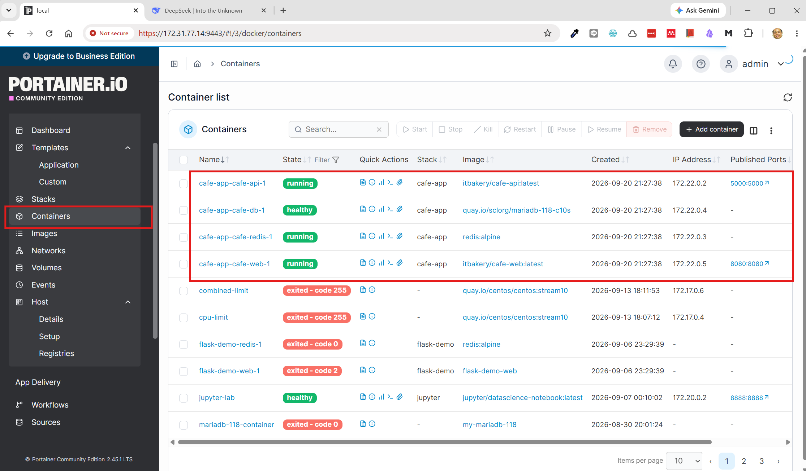


Thank you very much for your time and dedication throughout this course. As your instructor, it has been a real pleasure to learn and grow alongside you.

I truly believe that Docker technology will be a valuable asset — not only for your current projects, but also for your future career. The skills you've built here are the foundation for bigger things ahead.

Remember:
"Learning never stops. Every container you build, every error you fix, every problem you solve — is one step closer to mastery."

Aj. Sawangpong muadphet

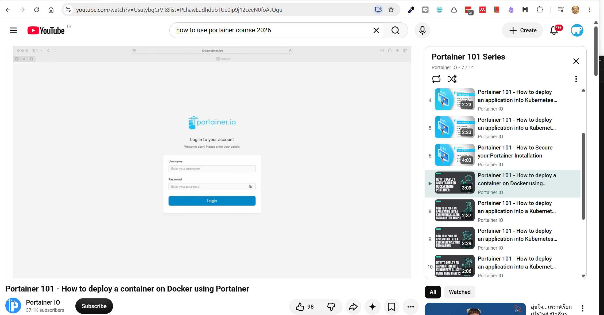

[portainer course](https://www.youtube.com/watch?v=UsutybgCrVI&list=PLhawEudhdubTUe0ip9j12ceeN0foAJQgu)